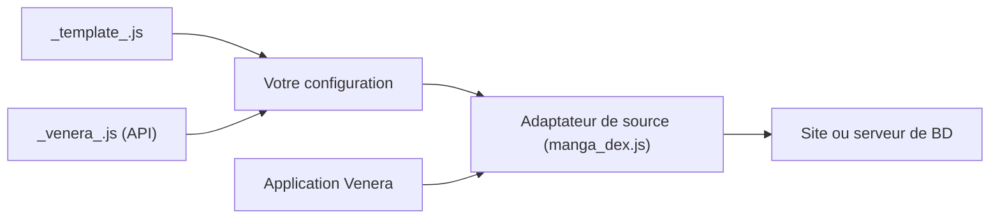

# venera-app/venera-configs

> Dépôt de configurations JavaScript de sources de bandes dessinées pour l'application Venera.

## Le problème
Venera a besoin d'adaptateurs pour lire des BD depuis chaque site ou serveur.

## Ce que ça fait vraiment
Contient des fichiers JS indépendants (MangaDex, Komga, Kavita, Lanraragi, E-Hentai, Hitomi, Copy Manga…), chacun implémentant navigation, recherche, détail et chapitres, parfois comptes, favoris et commentaires. Un gabarit `_template_.js` et un fichier d'API `_venera_.js` pour la complétion servent à en écrire de nouveaux. Le README est très court (moins de 800 caractères) : le détail vient de l'architecture d'après le code.

## Comment c'est branché


## Essayer
```bash
# README : télécharger _template_.js et _venera_.js dans le même dossier,
# renommer _template_.js en your_config_name.js, puis l'éditer.
```

## Coût et pièges
Gratuit, mais aucune licence n'est déclarée. Certaines sources sont du contenu adulte ou de droits incertains : à vérifier selon ton pays.

## Ce que ce n'est pas
Pas l'application Venera elle-même. Les sources sont indépendantes les unes des autres.

## Alternatives
Aucune alternative nommée dans le README.

## Pour toi
À ignorer : configurations pour un lecteur de BD, sans lien avec ton métier.

