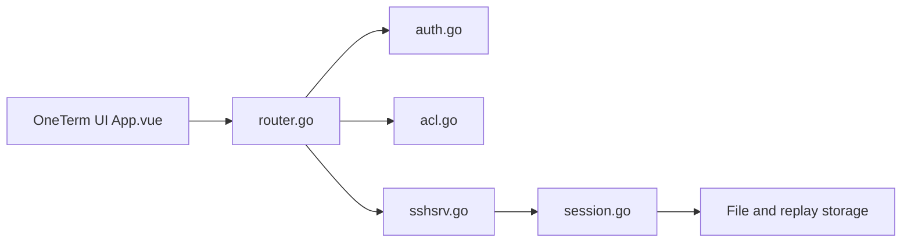

# veops/oneterm

> Bastion d'accès SSH/RDP en Go avec authentification, autorisations, enregistrement de sessions et audit.

## Le problème
Contrôler et tracer les accès privilégiés aux serveurs internes depuis un point d'entrée unique.

## Ce que ça fait vraiment
Les utilisateurs s'authentifient dans OneTerm puis se connectent aux machines autorisées via un serveur de rebond et des connecteurs de protocoles. Il enregistre les sessions pour relecture, gère les mots de passe, applique MFA et règles d'autorisation, propose un flux de demandes d'accès privilégié, et s'intègre au CMDB Veops. Backend Go, frontend Vue.

## Comment c'est branché


## Essayer
```bash
git clone https://github.com/veops/oneterm.git
cd oneterm/deploy
./setup.sh
docker compose up -d
# interface sur http://127.0.0.1:8666
```

## Coût et pièges
Gratuit. Le déploiement rapide garde le mot de passe par défaut 123456 : utiliser `setup.sh` en production. La branche `main` peut être instable ; préférer les releases. Dernier push en février 2026.

## Ce que ce n'est pas
Pas un outil data/IA : de la sécurité d'infrastructure. AGPL-3.0.

## Alternatives
Aucune alternative nommée dans le README.

## Pour toi
À ignorer pour un profil data/IA : un bastion relève de l'équipe infra, pas de ton quotidien.

