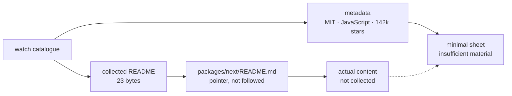

# vercel/next.js

> **A heavily starred Vercel JavaScript repository whose collected README holds nothing usable.**

## The problem

This cannot be established from the available material. The README collected for this
repository describes no need, no pain point and no use case. Without it, there is no way to
say what you lose by skipping this project.

## What it actually does

The collected README is a single line, `packages/next/README.md`: a pointer to another file
inside the repository, not a description. Nothing in the available material states what the
project does, what it exposes, or how it is used.

What is known comes only from catalogue metadata: repository `vercel/next.js`, MIT licence,
JavaScript as the main language, roughly 142,000 stars, published by Vercel. The star count
and the `packages/` directory in the quoted path suggest a mature, package-organised project,
but that is a reading of the path, not a claim from the README.

Any more precise description would be invention. It is not written here.

## How it is wired

No code-derived diagram exists for this repository, and the README does not allow a faithful
one to be reconstructed. The diagram below therefore represents the collected material
itself, not the project's architecture.



## Trying it

No command is documented in the available material: the collected README contains no
installation, no start-up step and no example. There is nothing to copy, and nothing will be
reconstructed from memory.

```bash
# No command documented in the collected README.
# The only hint is an in-repository pointer:
#   packages/next/README.md
```

## Cost and gotchas

The main gotcha is the material itself: collection returned a file pointer instead of a
README, and no sheet can be built on that. On cost, nothing is documented here — no API key,
no GPU, no Docker, no RAM figure, no third-party service, no quota, no account to create. The
MIT licence recorded in the catalogue is permissive and imposes no usage constraint, but says
nothing about running the project. The only inferable prerequisite is a Node environment,
from the language and the `packages/` directory.

## What it is not

This sheet is not a description of `vercel/next.js`: it records that the collected material
for this repository is empty. It is not a technical assessment, and the "watch" verdict
applies to the sheet, not to the project — a repository with 142,000 stars deserves more than
a one-line pointer.

Nor is it a final judgement: a fresh collection aimed at the right file
(`packages/next/README.md`) would make this sheet obsolete and require rewriting it.

## Alternatives

No comparable alternative can be established: the README names no project, and nothing in the
available material says what this repository competes with. Among the catalogue neighbours,
`gatsbyjs/gatsby` and `decaporg/decap-cms` belong to the same JavaScript web ecosystem, but
drawing a comparison would require knowing what this repository does, which the material does
not say. `DavidHDev/react-bits` and `Asabeneh/30-Days-Of-JavaScript` are not comparable.

## For you

Skip **this sheet**, not the repository. As it stands it offers nothing to a data / AI / MLOps
profile: it supports neither an evaluation nor a decision to try. The only useful action is to
re-run README collection against the correct path, then rewrite the sheet from real material.
