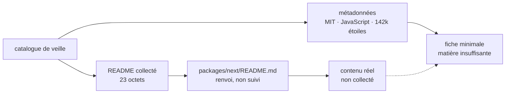

# vercel/next.js

> **Dépôt JavaScript très en vue de Vercel, dont le README collecté ne contient rien d'exploitable.**

## Le problème

Impossible à établir à partir de la matière disponible : le README récupéré pour ce dépôt ne
décrit ni un besoin, ni une douleur, ni un usage. Sans lui, on ne peut pas dire ce qu'on perd
à se passer de ce projet.

## Ce que ça fait vraiment

Le README collecté tient en une seule ligne, `packages/next/README.md` : c'est un renvoi vers
un autre fichier du dépôt, pas une description. Rien dans la matière disponible ne dit ce que
le projet fait, quelles fonctions il expose, ni comment il s'utilise.

Ce que l'on sait tient aux seules métadonnées du catalogue : dépôt `vercel/next.js`, licence
MIT, langage principal JavaScript, environ 142 000 étoiles, publié par Vercel. Le très grand
nombre d'étoiles et la présence d'un répertoire `packages/` indiquent un projet mûr et
organisé en paquets, mais c'est une lecture du chemin cité, pas une affirmation du README.

Toute description plus précise serait une invention : elle n'est pas écrite ici.

## Comment c'est branché

Aucun diagramme tiré du code n'existe pour ce dépôt, et le README ne permet pas d'en
reconstruire un fidèle. Le schéma ci-dessous ne représente donc que la matière collectée
elle-même, pas l'architecture du projet.



## Essayer

Aucune commande n'est documentée dans la matière disponible : le README collecté ne contient
ni installation, ni démarrage, ni exemple. Rien n'est recopiable, et rien ne sera reconstruit
de mémoire.

```bash
# Aucune commande documentée dans le README collecté.
# Le seul indice est un renvoi interne au dépôt :
#   packages/next/README.md
```

## Coût et pièges

Le piège principal est la matière elle-même : la collecte a ramené un renvoi de fichier à la
place du README, et une fiche ne peut pas être écrite dessus. Sur le coût, rien n'est
documenté ici — ni clé d'API, ni GPU, ni Docker, ni RAM, ni service tiers, ni quota, ni
compte à créer. La licence MIT relevée au catalogue est permissive et ne pose pas de
contrainte d'usage, mais elle ne renseigne en rien sur l'exploitation du projet. Le seul
prérequis déductible est un environnement Node, par le langage et la présence d'un
répertoire `packages/`.

## Ce que ce n'est pas

Cette fiche n'est pas une description de `vercel/next.js` : c'est le constat que la matière
collectée pour ce dépôt est vide. Elle ne vaut pas évaluation technique, et le verdict
« surveiller » porte sur la fiche, pas sur le projet — un dépôt à 142 000 étoiles mérite
mieux qu'une ligne de renvoi.

Ce n'est pas non plus un jugement définitif : une nouvelle collecte visant le bon fichier
(`packages/next/README.md`) rendrait cette fiche caduque et devrait être refaite.

## Alternatives

Aucune alternative comparable ne peut être établie : le README ne nomme aucun projet, et rien
dans la matière disponible ne dit à quoi ce dépôt se compare. Parmi les voisins fournis par
le catalogue, `gatsbyjs/gatsby` et `decaporg/decap-cms` relèvent du même écosystème
JavaScript web, mais les rapprocher supposerait de savoir ce que fait ce dépôt — ce que la
matière ne dit pas. `DavidHDev/react-bits` et `Asabeneh/30-Days-Of-JavaScript` ne sont pas
comparables.

## Pour toi

Passe ton chemin **sur cette fiche**, pas sur le dépôt. En l'état, elle n'apporte rien à un
profil data / IA / MLOps : elle ne permet ni d'évaluer un outil, ni de décider d'un essai. La
seule action utile est de relancer la collecte du README sur le bon chemin, puis de réécrire
la fiche depuis la matière réelle.
