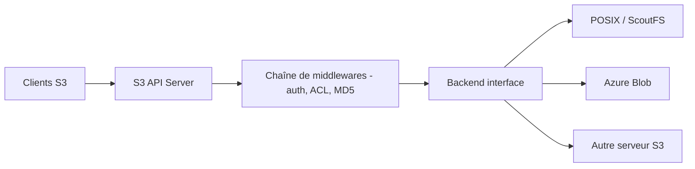

# versity/versitygw

> Passerelle S3 sans état qui expose un système de fichiers POSIX ou d'autres stockages en API S3.

## Le problème
Des applications parlent S3 alors que les données vivent sur un système de fichiers ou un autre stockage.

## Ce que ça fait vraiment
Le serveur traduit les requêtes S3 vers un backend : POSIX, ScoutFS, Azure Blob ou un autre serveur S3. Il est sans état, donc plusieurs instances peuvent tourner derrière un répartiteur de charge. Il apporte aussi un site web statique, une interface WebGUI optionnelle, S3 sur RDMA, des événements (Kafka, NATS, webhook) et des métriques StatsD. Le serveur HTTP repose sur Fiber, la compatibilité sur aws-sdk-go-v2.

## Comment c'est branché


## Essayer
```bash
mkdir /tmp/vgw /tmp/vers
ROOT_ACCESS_KEY="testuser" ROOT_SECRET_KEY="secret" ./versitygw --port :10000 --iam-dir /tmp/vgw posix --versioning-dir /tmp/vers /tmp/vgw
docker run --rm versity/versitygw:latest --version
helm install versitygw oci://ghcr.io/versity/versitygw/charts/versitygw
```

## Coût et pièges
Gratuit ; support entreprise auprès de Versity (payant). Le `--iam-dir` JSON est prévu pour les tests, pas pour un vrai contrôle d'accès.

## Ce que ce n'est pas
Ce n'est pas un stockage : il traduit vers un backend existant. Les affirmations de robustesse du README relèvent de l'éditeur, pas d'une mesure indépendante.

## Alternatives
Aucune alternative nommée dans le README.

## Pour toi
À surveiller : intéressant pour exposer un espace de fichiers en S3 à des pipelines data sans migrer les données.

