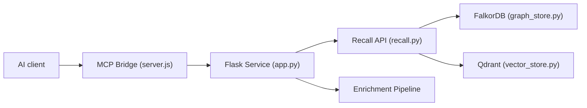

# verygoodplugins/automem

> Mémoire longue durée pour assistants IA, à base de graphe et de vecteurs, accessible par MCP ou REST.

## Le problème
Un assistant oublie décisions et préférences d'une conversation à l'autre, et la recherche vectorielle seule ne rend pas le pourquoi.

## Ce que ça fait vraiment
Service Flask qui stocke les souvenirs dans FalkorDB (graphe, 11 types de relations) et Qdrant (embeddings). Le rappel combine similarité, traversée du graphe, temps, tags et importance. Enrichissement et consolidation en arrière-plan. Pont MCP pour Claude, Cursor, Codex ; MCP distant pour ChatGPT. Aucun appel LLM pendant le rappel, mais des embeddings (Voyage, OpenAI ou local).

## Comment c'est branché


## Essayer
```bash
git clone https://github.com/verygoodplugins/automem.git
cd automem
make dev
npx @verygoodplugins/mcp-automem setup
```

## Coût et pièges
Deux bases à héberger (FalkorDB, Qdrant) ; embeddings payants selon le fournisseur. Si FalkorDB tombe, l'API renvoie 503.

## Ce que ce n'est pas
Pas un produit stable : le README liste des limites (tags en filtre strict, mise à jour temporelle imparfaite). Le score de 57,4 % sur BEAM vient de l'auteur.

## Alternatives
Aucune alternative nommée dans le README (il cite HippoRAG 2 et A-MEM comme sources de techniques).

## Pour toi
À surveiller : approche graphe plus vecteurs intéressante pour la mémoire d'agent ; pré-1.0, donc teste avant d'y stocker du contexte important.

