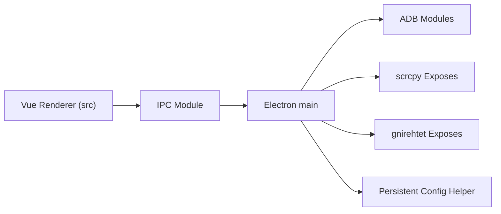

# viarotel-org/escrcpy

> Interface graphique de bureau pour afficher et piloter un téléphone Android avec scrcpy.

## Le problème
scrcpy s'utilise en ligne de commande, ce qui gêne la gestion de plusieurs appareils.

## Ce que ça fait vraiment
Application Electron/Vue : miroir intégré, mappage clavier, contrôle de plusieurs appareils, scripts d'automatisation visuels, connexion ADB sans fil, assistant « Copilot » basé sur MCP. Le processus principal Electron appelle adb, scrcpy et gnirehtet par IPC.

## Comment c'est branché

## Essayer
Aucune commande : installation par paquets de la page Releases, ou Homebrew via le dépôt homebrew-escrcpy.

## Coût et pièges
Gratuit, mais certaines fonctions avancées viennent d'un dépôt privé, EscrcpyX, vendu. Le README prévient : soutien limité, mises à jour irrégulières.

## Ce que ce n'est pas
Pas un outil de test mobile pour la CI, ni un service : c'est une appli de bureau locale.

## Alternatives
scrcpy est le composant de base cité par le README.

## Pour toi
Surveiller : utile pour piloter des appareils Android de test, mais périphérique à la data/IA et porté par une seule personne.

