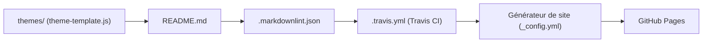

# viatsko/awesome-vscode

> Liste d'extensions, thèmes et ressources pour Visual Studio Code, classée par thème.

## Le problème
La place de marché de VS Code contient un très grand nombre d'extensions, et repérer les bonnes par langage ou par usage prend du temps.

## Ce que ça fait vraiment
Le README classe des extensions par rubriques : syntaxe, migration depuis d'autres éditeurs, lint et IntelliSense par langage (dont Python, Go, Rust), GitHub, productivité, formatage, thèmes et ressources pour auteurs d'extensions. Certaines entrées portent une mention d'obsolescence. L'architecture fournie est déduite du dépôt (Jekyll, Travis CI) et elle-même indique qu'aucun schéma n'existe dans la doc.

## Comment c'est branché

## Essayer
Aucune commande documentée : le README est la liste ; les contributions passent par les guides du dépôt.

## Coût et pièges
Gratuit, licence CC0. Une partie des entrées date (Travis CI, TSLint, extensions dépréciées) ; certaines sont commerciales (Monokai Pro, cours VSCode.pro). Dernier push le 2026-06-21.

## Ce que ce n'est pas
Ce n'est pas une sélection testée : entretien partiel, et rien n'est installé par le dépôt lui-même.

## Alternatives
Aucune alternative citée dans le README.

## Pour toi
À surveiller : point de départ pour équiper VS Code en Python ou Jupyter, mais la place de marché officielle reste plus à jour.

