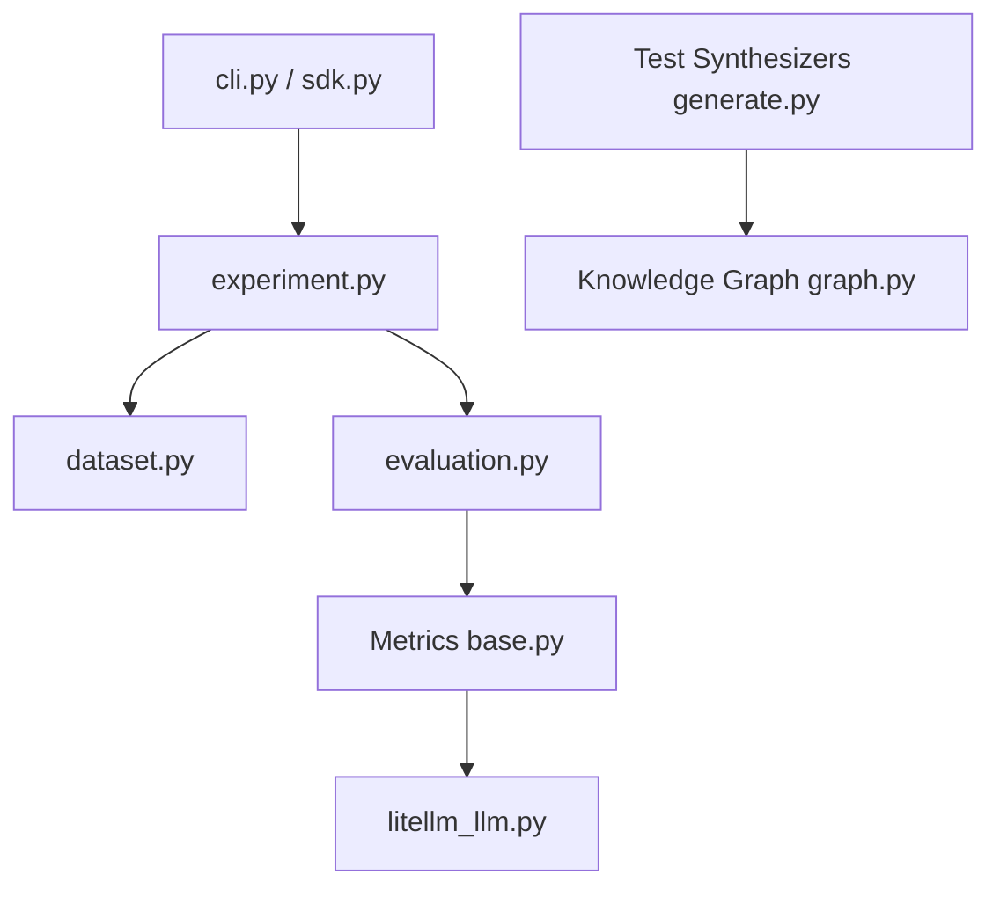

# vibrantlabsai/ragas

> Bibliothèque d'évaluation des applications LLM et RAG : métriques, génération de jeux de test, expériences.

## Le problème
Juger un RAG ou un agent « à l'œil » ne permet ni de comparer deux versions ni de repérer les régressions.

## Ce que ça fait vraiment
Métriques calculées par LLM et métriques classiques, plus des métriques sur mesure (`DiscreteMetric`) qui renvoient un score et une justification.
Il génère des jeux de test à partir d'un graphe de connaissances extrait des documents.
Une CLI `ragas quickstart` crée des projets modèles, pour l'instant seulement `rag_eval`.
Il s'intègre à LangChain et aux outils d'observabilité, avec des optimiseurs de prompts.

## Comment c'est branché


## Essayer
```bash
pip install ragas
pip install git+https://github.com/vibrantlabsai/ragas
ragas quickstart
ragas quickstart rag_eval
ragas quickstart rag_eval -o ./my-project
```

## Coût et pièges
Chaque évaluation appelle un LLM juge, qui est facturé (`OPENAI_API_KEY`). La télémétrie anonyme est active par défaut ; on la coupe avec `RAGAS_DO_NOT_TRACK=true`.

## Ce que ce n'est pas
Ce n'est pas une plateforme d'observabilité en production. Les modèles agents et benchmark ne sont pas encore disponibles. Dernier push le 2026-02-24.

## Alternatives
Le README ne nomme aucun dépôt alternatif.

## Pour toi
À adopter : c'est la référence open source pour évaluer tes RAG. Pense à couper la télémétrie et à budgéter les appels au LLM juge.
