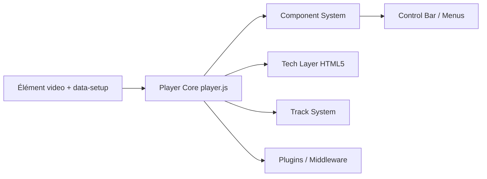

# videojs/video.js

> Lecteur vidéo open source pour navigateurs, avec HLS, DASH et écosystème de plugins, pour développeurs web.

## Le problème
Les lecteurs HTML5 natifs varient d'un navigateur à l'autre et ne lisent pas seuls les flux HLS ou DASH.

## Ce que ça fait vraiment
Video.js remplace l'élément `<video>` par un lecteur uniforme : barre de contrôle, menus, pistes audio, vidéo et texte (sous-titres), formats web courants, streaming HLS et DASH, plugins. Chargement par une balise avec un attribut `data-setup` ou par la fonction `videojs('id')`. D'après l'architecture : noyau du lecteur, système de composants, événements, couche « tech » HTML5, interface et pistes.

## Comment c'est branché


## Essayer
```bash
# Aucune commande shell documentée : intégration par balises HTML (CDN vjs.zencdn.net, unpkg, cdnjs) ou npm
```

## Coût et pièges
Gratuit ; la copie CDN est hébergée par Fastly. Licence présente mais non identifiée par GitHub : à vérifier. Le README annonce de grands changements avec Video.js 10.

## Ce que ce n'est pas
Pas un service d'hébergement ni de transcodage vidéo : il lit des flux existants.

## Alternatives
- Aucune alternative nommée dans le README.

## Pour toi
Ignorer : un lecteur vidéo web n'apporte rien à un flux data/IA/MLOps, et la licence non identifiée ajoute un doute.

