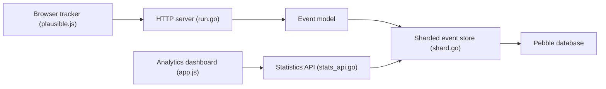

# vinceanalytics/vince

> Alternative auto-hébergée à Google Analytics, en un seul binaire Go, compatible avec les scripts Plausible.

## Le problème
Mesurer l'audience d'un site sans cookies ni envoi de données à Google, et sans empiler Elixir, ClickHouse et PostgreSQL comme Plausible.

## Ce que ça fait vraiment
Reçoit les événements d'un script de suivi, les stocke dans une base Pebble par fragments et sert un tableau de bord et une API de statistiques (agrégats, ventilations, séries temporelles, visiteurs actuels). Suit liens sortants, téléchargements, pages 404 et événements personnalisés ; TLS automatique Let's Encrypt, tableaux de bord publics ou partagés avec mot de passe. Sites et événements illimités ; ni multi-tenant ni entonnoirs.

## Comment c'est branché


## Essayer
```bash
curl -fsSL https://vinceanalytics.com/install.sh | bash
vince admin --name acme --password 1234
vince serve
docker pull ghcr.io/vinceanalytics/vince
```

## Coût et pièges
Gratuit ; tu héberges et sauvegardes toi-même. Dernier push en septembre 2025. L'exemple du README utilise un mot de passe trivial, à changer. AGPL-3.0 : obligations en cas de service réseau modifié.

## Ce que ce n'est pas
Pas un équivalent complet de Plausible (le tableau du README liste ce qui manque). Pas un service hébergé.

## Alternatives
- Plausible Analytics (cité) : plus complet, avec multi-tenant et entonnoirs, mais plus de dépendances.

## Pour toi
À surveiller : pratique pour mesurer l'usage d'une démo ou d'une documentation, mais peu actif depuis un an ; compare à Plausible avant de t'engager.

