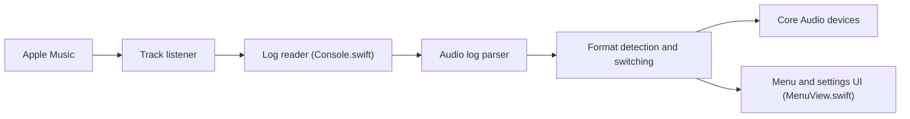

# vincentneo/LosslessSwitcher

> Application macOS dans la barre de menus qui règle la fréquence d'échantillonnage selon le morceau Apple Music.

## Le problème
Sous macOS, Apple Music ne change pas automatiquement la fréquence de la sortie audio ; il faut passer à la main par Audio MIDI Setup.

## Ce que ça fait vraiment
Lit les journaux système de macOS pour connaître le format du morceau en cours, choisit un format pris en charge par le périphérique de sortie et l'applique via Core Audio. Affiche la fréquence dans la barre de menus ; la profondeur de bits est optionnelle mais réduit la fiabilité, et un script utilisateur peut être déclenché. Des interruptions de lecture brèves sont possibles.

## Comment c'est branché

## Essayer
Aucune commande documentée : télécharger le `.zip` de la version voulue et glisser l'app dans Applications.

## Coût et pièges
Gratuit. Non sandboxée ; l'utilisateur doit être administrateur ; la lecture fréquente des journaux peut accélérer l'usure de la batterie d'un portable. La version 2.0 pour macOS Sequoia 15.4+ est encore en bêta d'après le README.

## Ce que ce n'est pas
Pas un lecteur audio ni un convertisseur : il ne change que la fréquence du périphérique. Ne fonctionne qu'avec Apple Music.

## Alternatives
Aucune alternative nommée dans le README.

## Pour toi
À ignorer : utilitaire de confort audio pour Mac, sans rapport avec la data, l'IA ou le MLOps.

