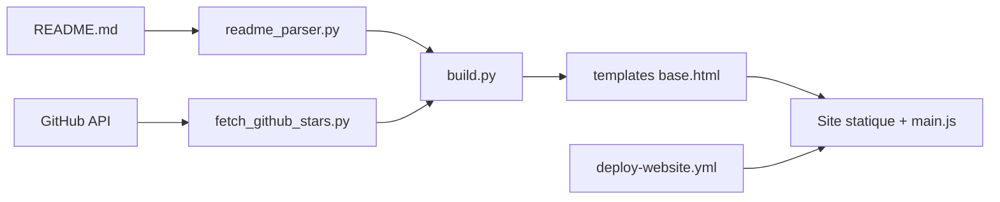

# vinta/awesome-python

> Liste commentée de bibliothèques et outils Python rangés par domaine, pour qui cherche une brique.

## Le problème
Trouver la bonne bibliothèque Python pour un besoin (ORM, scraping, service LLM, tests) oblige à trier des résultats de recherche hétérogènes et souvent datés.

## Ce que ça fait vraiment
Un seul `README.md` porte la liste : une centaine de catégories (IA & ML, Web, Data & Science, DevOps, sécurité…), une ligne par projet. La sélection est assumée comme « opinionated ».
`website/readme_parser.py` transforme ce Markdown en données structurées, `website/fetch_github_stars.py` y ajoute les étoiles via l'API GitHub, puis `website/build.py` génère un site statique où l'on cherche et filtre (`main.js`), plus une page `llms.txt`.
Deux workflows GitHub Actions : validation (`ci.yml`) et publication du site (`deploy-website.yml`).

## Comment c'est branché

## Essayer
Aucune commande documentée dans le README : on lit la liste, ou le site généré.

## Coût et pièges
Rien à payer ni à installer pour lire. Licence présente mais non identifiée par GitHub : à vérifier avant de réutiliser le contenu.

## Ce que ce n'est pas
Ce n'est pas un comparatif : aucune mesure, une ligne de description par projet, souvent reprise du discours du projet lui-même. Ni exhaustif ni neutre, puisque la sélection est revendiquée comme subjective.

## Alternatives
- awesome-deep-learning — le README y renvoie pour le deep learning.
- awesome-machine-learning — le README y renvoie pour le machine learning.

## Pour toi
À garder en favori : la section AI & ML (vllm, peft, dspy, LiteLLM, instructor) sert de point de départ rapide.
