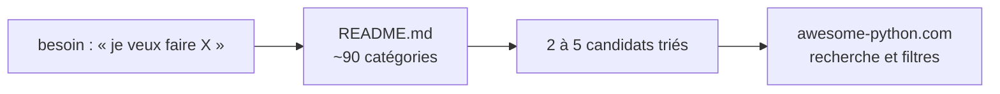

# vinta/awesome-python

> **L'annuaire de référence de l'écosystème Python, rangé par usage — pas un logiciel.**

## Le problème

Choisir une bibliothèque Python, c'est arbitrer entre quinze paquets dont trois sont morts,
cinq font la même chose et deux sont devenus le standard sans que personne l'ait annoncé.
PyPI ne classe pas, ne trie pas, ne jette rien.

## Ce que ça fait vraiment

Un unique fichier markdown de plusieurs milliers de lignes, découpé en ~90 catégories
d'usage (ORM, tâches asynchrones, CLI, vision, NLP, sérialisation, tests…). Chaque entrée :
un lien, une ligne de description. **La sélection est assumée comme subjective**
(« opinionated ») — c'est ce qui en fait la valeur : on y trouve deux ou trois candidats par
besoin, pas les cinquante existants. Un site miroir permet de chercher et filtrer.

## Comment c'est branché



## Essayer

```bash
# Rien à installer. Le dépôt cloné donne une version consultable hors ligne :
git clone --depth 1 https://github.com/vinta/awesome-python
```

## Ce qu'il faut avoir

Rien.

## Ce que ce n'est pas

- **Ce n'est pas une bibliothèque**, malgré ce que dit la facette du catalogue — rien à
  importer, rien à installer. (Erreur de classement à corriger.)
- **Ce n'est pas à jour partout.** Des entrées traînent depuis des années ; la date de
  dernier commit du dépôt ne dit rien de la fraîcheur d'une ligne donnée. Toujours vérifier
  l'activité du paquet avant de l'adopter.
- **Licence non déclarée (`NOASSERTION`)** : le contenu est consultable, mais ne le recopie
  pas tel quel dans une doc interne ou un livrable client.

## Alternatives

| | Quand le préférer |
|---|---|
| **PyPI + tri par téléchargements** | Tu connais déjà le nom et tu veux la santé du paquet. |
| **Ton propre catalogue de veille** | Pour ce qui bouge *maintenant* : awesome-python est une photo lente, ton catalogue une vidéo. |
| **awesome-python-applications** | Tu cherches des applications finies, pas des briques. |

## Pour toi

Utile une fois par trimestre, quand tu attaques un domaine que tu ne connais pas — pas en
veille quotidienne. Sa vraie valeur pour toi : **la taxonomie des ~90 catégories**, qui est
un bon point de comparaison pour les facettes « sujets » de ton propre catalogue.
