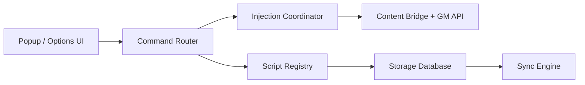

# violentmonkey/violentmonkey

> Extension de navigateur pour installer et exécuter des scripts utilisateur sur les pages web.

## Le problème
Adapter le comportement de sites web (interface, données, automatisations légères) sans attendre leurs éditeurs demande d'injecter du code dans les pages.

## Ce que ça fait vraiment
Extension WebExtension qui installe, stocke, met à jour, synchronise et exécute des scripts utilisateur. Un routeur de commandes en arrière-plan, un coordinateur d'injection et un pont de contenu fournissent les API `GM_*`. Synchronisation via Dropbox, GitHub, Google Drive, OneDrive, WebDAV ou S3.

## Comment c'est branché


## Essayer
```sh
pnpm ci
pnpm dev
pnpm run ci
pnpm build
```

## Coût et pièges
Gratuit. Les versions d'essai sont potentiellement instables : exporter ses réglages avant. Un script utilisateur s'exécute avec accès aux pages visitées : n'installer que du code lu.

## Ce que ce n'est pas
Ce n'est pas un store de scripts ni un outil de scraping : il ne fournit que l'exécution.

## Alternatives
Aucune alternative nommée dans le README.

## Pour toi
À ignorer pour ton métier : simple confort de navigation, sans lien direct avec la data ou l'IA.

