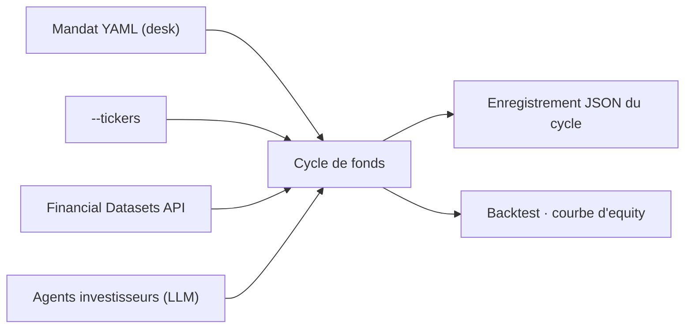

# virattt/ai-hedge-fund

> Preuve de concept d'un fonds piloté par des agents LLM, à but pédagogique.

## Le problème
Comprendre comment des agents LLM combinent stratégies, risque et cadence de rééquilibrage suppose un bac à sable complet.

## Ce que ça fait vraiment
Une application terminale interactive pour construire un « fonds » — titres, stratégies, cadence de rééquilibrage — puis le backtester avec sa courbe d'equity face à un benchmark. Les fonds sont sauvés en fichiers de mandat dans `~/.hedge-fund/mandates/`. Un mandat décrit le desk (stratégies, staff, risque, capital, cadence) et ne nomme jamais de ticker : `--tickers` le fait au moment du run. En mode non interactif, le cycle complet sort en JSON sur stdout. Le projet est en cours de refonte vers un fonds persistant avec agents investisseurs transformés en « alpha models » enfichables.

## Comment c'est branché


## Essayer
```bash
pipx install aihf
aihf
aihf ~/.hedge-fund/mandates/example.yaml --tickers AAPL,MSFT --backtest
```

## Coût et pièges
Deux clés nécessaires : Financial Datasets (prix, fondamentaux, résultats) et un fournisseur de modèle parmi Anthropic, OpenAI, DeepSeek, Google, xAI, Kimi, TypeSafe. Les clés sont sauvegardées dans `~/.hedge-fund/.env`.

## Ce que ce n'est pas
Le README est explicite : usage éducatif et de recherche seulement, aucun trade réel n'est passé, aucun conseil d'investissement, aucune garantie, le créateur décline toute responsabilité financière. Le projet est en refonte : l'API peut bouger.

## Alternatives
Aucune alternative nommée dans le README.

## Pour toi
À surveiller : bon terrain pour observer une orchestration multi-agents avec backtest, à ne jamais confondre avec un outil de gestion.
