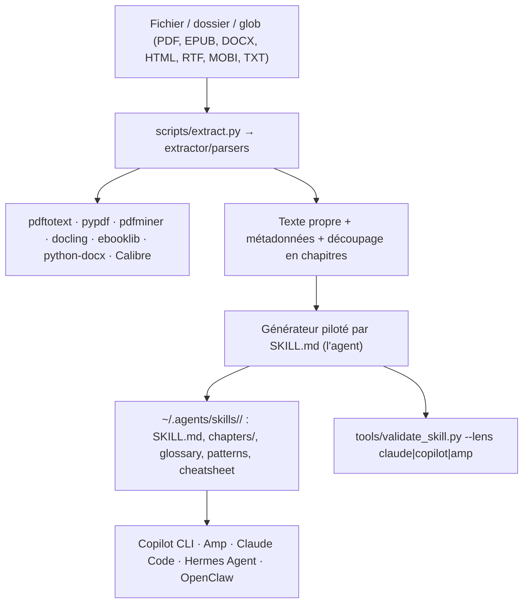

# virgiliojr94/book-to-skill

> Convertisseur qui transforme un livre technique ou un dossier de docs en Agent Skill interrogeable.

## Le problème
Un livre technique lu une fois est oublié trois mois plus tard, et le chercher dans le PDF rend des pages, pas des réponses.
Verser le PDF entier dans le contexte de l'agent coûte cher à chaque question.

## Ce que ça fait vraiment
Un extracteur Python déterministe transforme le document en texte propre plus des métadonnées, puis un générateur piloté par spec en fait une arborescence de skill.
Le résultat : un `SKILL.md` (~4 000 tokens) avec les modèles mentaux et l'index, un fichier par chapitre chargé à la demande (~1 000 tokens), plus glossaire, patterns et cheatsheet.
Les fichiers de chapitre ne comptent dans le budget que si la question porte sur ce chapitre.
Le dépôt annonce 24×–51× de tokens en moins qu'un dump du livre en contexte, avec la méthodologie dans `docs/performance.md`.

## Comment c'est branché


## Essayer
```bash
# Installation via le CLI cross-agent
npx skills add virgiliojr94/book-to-skill

# Ou à la main
git clone https://github.com/virgiliojr94/book-to-skill.git ~/.claude/skills/book-to-skill

# Vérifier quels extracteurs sont présents
python3 scripts/extract.py --check

# PDF scanné : OCR d'abord
ocrmypdf input.pdf output.pdf
```

## Coût et pièges
Gratuit côté outil, mais la conversion est faite par ton agent : c'est ton quota de modèle qui paie l'extraction structurée, une fois par livre.
`docling` (recommandé pour les livres techniques) tourne à ~1,5 s par page, et un PDF scanné sans couche texte est rejeté d'emblée.

## Ce que ce n'est pas
Ce n'est pas un lecteur de PDF ni un moteur RAG : rien n'est indexé vectoriellement, l'agent lit des fichiers markdown.
Ce n'est pas un résumé — et volontairement pas une reproduction : le skill généré ne recopie pas les passages, ce qui limite les citations littérales.
Ce n'est pas partageable : le README rappelle que publier le skill d'un livre sous droits peut enfreindre ces droits.

## Alternatives
Aucun dépôt concurrent n'est nommé dans le README.

## Pour toi
Intéressant pour plier ta doc interne ou une pile de papiers en un skill interrogeable ; l'argument 24×–51× reste à vérifier sur ton propre corpus.
