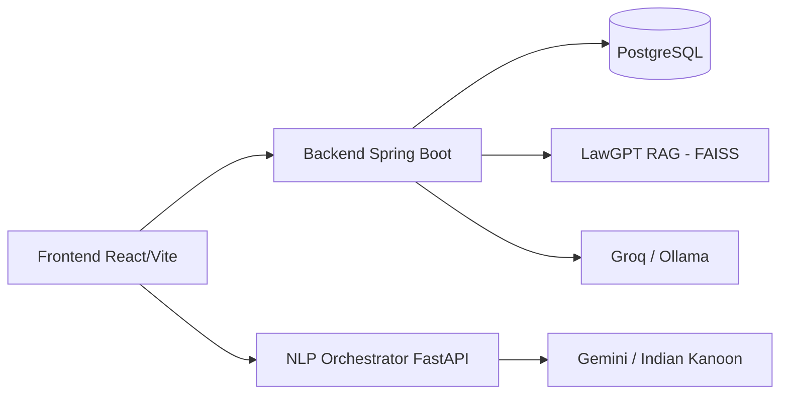

# viru0909-dev/nyay-setu-working

> Plateforme judiciaire indienne avec assistant juridique IA, gestion de dossiers et audiences virtuelles.

## Le problème
Millions d'affaires en attente en Inde, avec des citoyens sans avocat : le README vise à outiller tout le circuit judiciaire.

## Ce que ça fait vraiment
Monorepo : front React/Vite, backend Spring Boot (JWT, dossiers, coffre de preuves SHA-256, PostgreSQL), `nlp-orchestrator` FastAPI (recherche profonde en SSE, Groq, Gemini, Indian Kanoon), service RAG `lawgpt-service` (FAISS), traduction Bhashini, signalisation WebRTC et pipeline média RabbitMQ/FFmpeg.

## Comment c'est branché


## Essayer
```bash
cd frontend/nyaysetu-frontend && npm install && npm run dev
cd backend/nyaysetu-backend && mvn spring-boot:run
cd nlp-orchestrator && pip install -r requirements.txt && python main.py
```

## Coût et pièges
Clés Groq et Gemini, PostgreSQL 15+, Java 17, Node 20+, Python 3.12+. Licence présente mais non identifiée : à vérifier. 583 issues ouvertes.

## Ce que ce n'est pas
Pas un conseil juridique validé ; le README ne cite aucune évaluation de l'assistant. Le README mélange plusieurs documents (pipeline média incomplet) et les versions prérequises divergent.

## Alternatives
Aucune nommée dans le README.

## Pour toi
Surveiller : l'assemblage RAG (FAISS) et recherche en SSE est instructif à lire, mais projet jeune, à un seul auteur, licence floue et non évalué.

