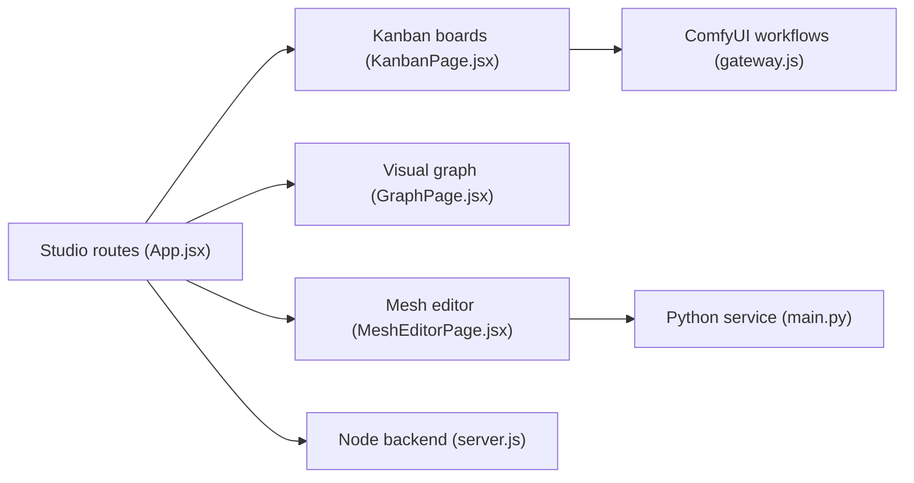

# visualbruno/3DGenStudio

> Atelier local de production 3D qui orchestre ComfyUI et des API externes, de l'image au maillage texturé.

## Le problème
Passer d'une image à un maillage 3D texturé enchaîne plusieurs outils (texte vers image, retouche, génération de maillage, UV, texture) à suivre à la main.

## Ce que ça fait vraiment
Un espace de travail Kanban et graphe où chaque carte avance par étapes (images, retouche, maillage, édition, texture) en lançant des workflows ComfyUI ou des API REST/GraphQL. Inclut une bibliothèque d'actifs, un éditeur de maillage (sculpture, peinture, UV, retopologie, rigging, LOD, bake) et un service Python (Blender `bpy`) ; l'architecture mentionne aussi un serveur MCP et des importeurs Unity/Unreal. Projets stockés localement sur disque.

## Comment c'est branché


## Essayer
```bash
git clone https://github.com/visualbruno/3DGenStudio.git
cd 3DGenStudio
npm install
npm run dev
cd python-server
python -m venv .venv
pip install -r requirements.txt
python main.py
```

## Coût et pièges
Nécessite une installation ComfyUI et souvent un GPU pour les modèles. Le mode mouvement (Kimodo) télécharge Meta Llama 3-8B (~16 Go) sous licence Meta, à accepter. Sur macOS : Apple Silicon seulement, app non notarisée. Licence du dépôt non identifiée par GitHub.

## Ce que ce n'est pas
Pas un modèle de génération 3D : il pilote d'autres outils. Pas une solution cloud.

## Alternatives
Aucune alternative nommée dans le README (TripoSR et Wonder3D sont cités comme exemples de workflows).

## Pour toi
À surveiller : bon exemple d'orchestration ComfyUI en pipeline, mais jeune, à un seul auteur, et lourd en prérequis.

