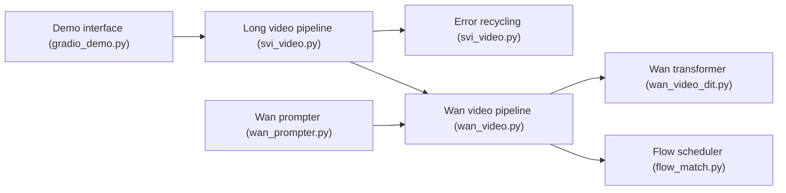

# vita-epfl/Stable-Video-Infinity

> Méthode et poids LoRA pour générer des vidéos de longueur illimitée à partir de Wan 2.1.

## Le problème
Les modèles vidéo dérivent et oublient quand on prolonge la vidéo au-delà de quelques secondes.

## Ce que ça fait vraiment
SVI ajoute des adaptateurs LoRA au modèle Wan 2.1 I2V 14B, entraînés par « Error-Recycling Fine-Tuning » : les erreurs du transformeur sont réinjectées et mémorisées pour qu'il apprenne à les corriger. Variantes : SVI-2.0, Shot, Film, Tom&Jerry, Talk (audio), Dance (squelette). Le dépôt fournit scripts d'inférence, d'entraînement, démo Gradio, workflow ComfyUI et jeux de données de test.

## Comment c'est branché


## Essayer
```bash
conda create -n svi python=3.10
conda activate svi
pip install -e .
huggingface-cli download Wan-AI/Wan2.1-I2V-14B-480P --local-dir ./weights/Wan2.1-I2V-14B-480P
bash scripts/test/svi_shot.sh
```

## Coût et pièges
Testé sur A100 80 Go ; entraînements testés sur 8 et 64 GPU ; poids de base de plusieurs dizaines de Go. `flash_attn` s'installe parfois mal. Le bloc SVI-2.0 du README est tronqué (bloc de code non fermé).

## Ce que ce n'est pas
Pas un outil prêt pour un portable : il demande un GPU de datacenter. Les workflows ComfyUI publics n'incluent que SVI-Shot.

## Alternatives
Aucune alternative nommée dans le README (Self-Forcing est cité comme approche différente).

## Pour toi
À surveiller : recherche ouverte et reproductible sur la vidéo longue, utile si tu disposes de GPU ; sinon à lire pour l'idée.

