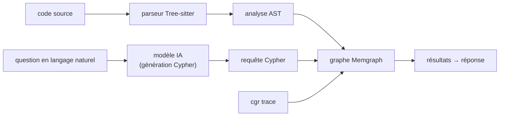

# vitali87/code-graph-rag

> Indexe un monorepo multi-langage en graphe de connaissances et l'interroge en langage naturel.

## Le problème
Un RAG classique découpe le code en morceaux de texte et perd les appels, l'héritage et les modules :
les questions structurelles (« qui appelle ça ? », « quel code est mort ? ») restent sans réponse.

## Ce que ça fait vraiment
Un parseur Tree-sitter lit chaque fichier source et ingère fonctions, classes, méthodes, modules et
leurs relations dans Memgraph sous un schéma unique, indépendant du langage. Ensuite `codebase_rag/`
traduit la question en Cypher, récupère le code réel, et pilote édition et optimisation : patch
chirurgical AST avec aperçu du diff, détection de code mort en remontant les arêtes d'appel depuis
les points d'entrée, recherche-réécriture structurelle via ast-grep. `cgr trace` fusionne en plus les
appels réellement survenus pendant un test ou un profil eBPF, ce que l'analyse statique ne voit pas.

## Comment c'est branché


## Essayer
```bash
uv tool install "code-graph-rag[treesitter-full,semantic]"
# ou : pipx install "code-graph-rag[treesitter-full,semantic]"
cgr daemon up
cgr start --repo-path /path/to/repo --update-graph
cgr start --repo-path /path/to/repo
uv tool install "code-graph-rag[treesitter-full,semantic] @ git+https://github.com/vitali87/code-graph-rag@main"
```

## Coût et pièges
Python 3.12+, Docker (Memgraph), `cmake` et `ripgrep` requis. La génération de Cypher passe par un
modèle IA : la clé est à ta charge. `--clean` détruit **tous** les projets du graphe partagé, pas
seulement le courant. PyPI ne publie qu'une version sur 50 : le tag `main` est loin devant.

## Ce que ce n'est pas
Pas une base vectorielle de code : l'extra `semantic` s'ajoute mais le cœur est un graphe Cypher.
Pas libre d'usage sans réflexion : des offres cloud gérée, on-premise et air-gapped payantes sont
mises en avant, ce qui suggère un modèle open-core.

## Alternatives
Aucune alternative nommée : le README cite ses briques (Tree-sitter, Memgraph, Qdrant, ast-grep).

## Pour toi
Le plus crédible des « RAG sur code » que j'aie vu passer : à tester sur un vrai monorepo.
