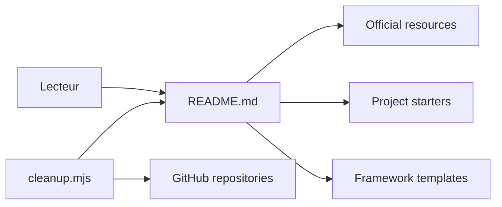

# vitejs/awesome-vite

> Liste organisée de ressources, gabarits, plugins et intégrations autour de Vite, pour développeurs front-end.

## Le problème
L'écosystème Vite compte des centaines de plugins et gabarits dispersés ; trouver le bon point de départ demande de fouiller npm et GitHub.

## Ce que ça fait vraiment
Un README classé par catégories : ressources officielles, outils de démarrage, gabarits (Vue, React, Svelte, Solid, Electron…), plugins (intégrations, chargeurs, bundling, tests, sécurité), SSR, intégrations backend (Django, Rails, Laravel, Go…), migrations et projets utilisant Vite. Un script `cleanup.mjs` vérifie les dépôts liés et retire ceux sans commit depuis six mois. Le README précise que la liste des plugins n'est plus mise à jour et renvoie au Vite Plugin Registry.

## Comment c'est branché

## Essayer
Aucune commande documentée : on lit le README.

## Coût et pièges
Gratuit. Une partie de la liste est périmée (le README le dit pour les plugins) ; vérifier la fraîcheur de chaque lien.

## Ce que ce n'est pas
Pas un outil ni une bibliothèque : aucun code applicatif, juste un annuaire. Ce n'est pas le dépôt officiel de Vite.

## Alternatives
- Vite Plugin Registry (cité dans le README) : liste les plugins publiés sur npm, plus à jour.
- Awesome Vue (cité dans les ressources officielles) pour le versant Vue.

## Pour toi
À surveiller seulement : utile pour dénicher un gabarit si tu montes une interface de démonstration pour un modèle, mais rien de spécifique data/IA.

