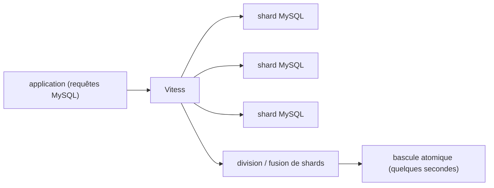

# vitessio/vitess

> Système de base de données distribué et horizontalement extensible, bâti autour de MySQL.

## Le problème
Un MySQL unique finit par saturer, et fragmenter les données oblige à réécrire le code applicatif
et les requêtes pour savoir où chaque ligne est stockée.

## Ce que ça fait vraiment
Vitess vise une mise à l'échelle sans limite par un sharding généralisé. Le code applicatif et les
requêtes restent indifférents à la répartition des données sur plusieurs serveurs de base. Les shards
peuvent être divisés et fusionnés à mesure que les besoins grandissent, avec une étape de bascule
atomique qui ne dure que quelques secondes. Le README ne décrit ni l'architecture, ni l'installation :
il renvoie à `vitess.io`, au Slack du projet et au processus de sécurité, et signale un audit de
sécurité externe réalisé par ADA Logics.

## Comment c'est branché

## Essayer
Aucune commande n'est documentée dans ce README : il renvoie au site `vitess.io`.

## Coût et pièges
Le coût réel est opérationnel : des dizaines de milliers de nœuds MySQL chez YouTube donnent l'ordre
de grandeur de l'échelle visée. Le README ne mentionne ni licence, ni prérequis, ni procédure
d'exploitation.

## Ce que ce n'est pas
Pas un remplaçant de MySQL : c'est une couche autour de MySQL, qui reste nécessaire. Pas un outil de
poste de travail ni de petit déploiement. Ce README n'est pas une documentation — c'est une page de
présentation avec des canaux de contact.

## Alternatives
Aucune alternative n'est nommée dans le README.

## Pour toi
Hors périmètre : à ignorer sauf si tu hérites un jour d'un MySQL en fin de capacité.
