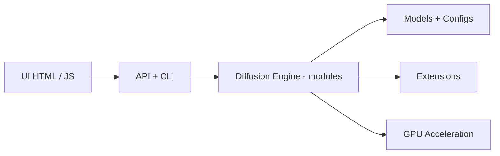

# vladmandic/automatic

> Interface web tout-en-un (SD.Next) pour générer, légender et traiter images et vidéos par diffusion.

## Le problème
Utiliser des dizaines de modèles de diffusion sur du matériel varié sans assembler soi-même les dépendances.

## Ce que ça fait vraiment
Serveur et WebUI dérivés d'AUTOMATIC1111, avec téléchargement automatique des modèles, quantification SDNQ (jusqu'à 4× moins de VRAM d'après le README), délestage équilibré CPU/GPU, légendes par 25 modèles LLM/VLM, retouche d'image, extensions, et détection de plateforme (NVIDIA, AMD, Intel Arc, macOS, DirectML, OpenVINO, ZLUDA). Interfaces bureau et mobile, environ 15 langues.

## Comment c'est branché


## Essayer
```bash
git clone https://github.com/vladmandic/sdnext
cd sdnext
./webui.sh
```
(Windows : `webui.bat` ; PowerShell : `webui.ps1`.)

## Coût et pièges
Gratuit ; les modèles peuvent peser plusieurs Go et demandent GPU et VRAM (chiffres non donnés ici). Les guides spécifiques par plateforme sont dans la documentation.

## Ce que ce n'est pas
Pas un modèle : c'est l'interface. Un seul mainteneur principal, donc un risque de continuité malgré l'activité.

## Alternatives
Automatic1111 WebUI (base de code d'origine, citée dans les crédits).

## Pour toi
À adopter pour expérimenter la génération d'images en local avec beaucoup de modèles ; pas destiné à un service de production.
