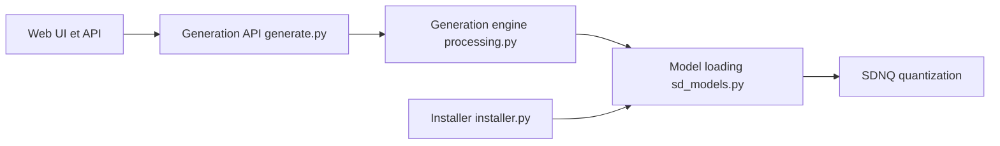

# vladmandic/sdnext

> WebUI et serveur de génération d'images et de vidéo basé sur Stable Diffusion et de nombreux modèles de diffusion.

## Le problème
Faire tourner de gros modèles de diffusion sur du matériel varié avec une interface unique.

## Ce que ça fait vraiment
Télécharge automatiquement des modèles, génère images/vidéos, fait du img2img, ControlNet, LoRA, upscaling, légendage et tagging (25+ modèles LLM/VLM). SDNQ quantifie à la volée (jusqu'à 4× moins de VRAM) et le Balanced Offload répartit CPU/GPU. Installeur avec mises à jour, ~15 langues.

## Comment c'est branché


## Essayer
```bash
git clone https://github.com/vladmandic/sdnext
cd sdnext
./webui.sh
```

## Coût et pièges
GPU recommandé (NVIDIA, AMD, Intel Arc, Apple, DirectML…) ; téléchargements de modèles volumineux. Les guides par plateforme sont externes au README.

## Ce que ce n'est pas
Pas un hébergement : tout tourne localement. Base issue d'Automatic1111.

## Alternatives
Cite AUTOMATIC1111 comme origine du code.

## Pour toi
À surveiller : bon banc d'essai pour la diffusion en local, si tu as un GPU ; dépend fortement d'un seul mainteneur.

