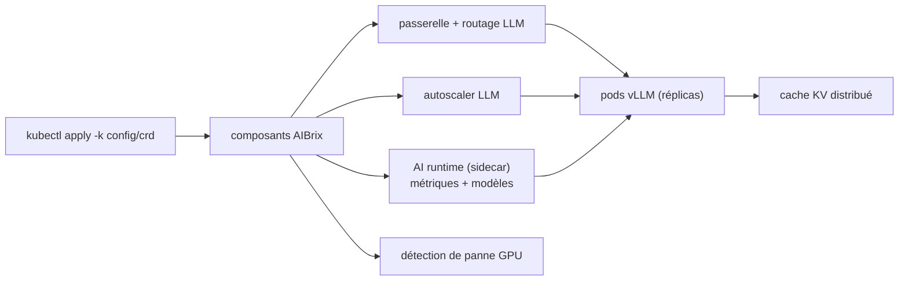

# vllm-project/aibrix

> Plan de contrôle Kubernetes pour servir des LLM avec vLLM à l'échelle d'une entreprise.

## Le problème
vLLM sert un modèle sur une machine ; router le trafic entre réplicas, autoscaler selon la charge
réelle, mutualiser le cache KV et détecter une carte défaillante n'est pas dans son périmètre.

## Ce que ça fait vraiment
Fournit les briques d'une infrastructure d'inférence : gestion dense de LoRA, passerelle et routage
LLM entre modèles et réplicas, autoscaler taillé pour les applis LLM, runtime unifié en sidecar
(standardisation des métriques, téléchargement et gestion des modèles), inférence distribuée
multi-nœuds, cache KV distribué réutilisable entre moteurs, service hétérogène à coût maîtrisé avec
garanties de SLO, et détection proactive des pannes matérielles GPU. Livré en CRD + composants
installés par `kubectl apply`, CRD séparés de l'opérateur pour qu'une désinstallation n'efface pas
les ressources utilisateur.

## Comment c'est branché


## Essayer
```bash
git clone https://github.com/vllm-project/aibrix.git && cd aibrix
kubectl apply -k config/dependency --server-side
kubectl apply -k config/crd --server-side
kubectl apply -k config/default
kubectl apply -f "https://github.com/vllm-project/aibrix/releases/download/v0.7.0/aibrix-dependency-v0.7.0.yaml" --server-side
kubectl apply -f "https://github.com/vllm-project/aibrix/releases/download/v0.7.0/aibrix-core-crds-v0.7.0.yaml" --server-side
kubectl apply -f "https://github.com/vllm-project/aibrix/releases/download/v0.7.0/aibrix-core-v0.7.0.yaml"
```

## Coût et pièges
Gratuit, mais suppose un cluster Kubernetes avec GPU et l'ops correspondante. Deux canaux
d'installation (nightly par kustomize, stable par YAML de release) : mélanger les deux est le piège
évident. Le README renvoie la configuration réelle à la documentation externe.

## Ce que ce n'est pas
Pas un moteur d'inférence : c'est la couche au-dessus de vLLM, qui reste requis. Pas un
« quickstart » utilisable tel quel : le README ne montre que l'installation, aucun exemple de
déploiement de modèle ni de requête.

## Alternatives
Aucune alternative nommée dans le README.

## Pour toi
La référence à connaître si un jour tu dois servir plusieurs LLM sur K8s ; lourd sinon.
