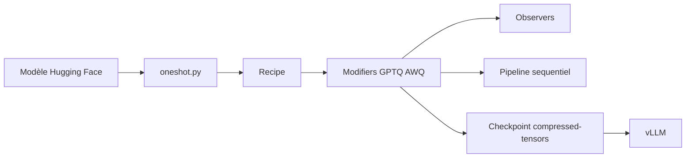

# vllm-project/llm-compressor

> Bibliothèque Python pour quantifier des modèles Hugging Face et les servir avec vLLM.

## Le problème
Un LLM en pleine précision coûte trop de mémoire GPU ; quantifier proprement demande des algorithmes et un format de sortie que le serveur sait lire.

## Ce que ça fait vraiment
On charge un modèle, on choisit une recette (par exemple `QuantizationModifier` en FP8) puis on appelle `oneshot`. Les algorithmes couvrent GPTQ, AWQ, AutoRound, SmoothQuant, SparseGPT, la quantification des activations, du cache KV et de l'attention (INT4, FP8, NVFP4, MXFP4). Le modèle est enregistré au format `compressed-tensors`, lu par vLLM. Un chemin « sans définition de modèle » existe, et la calibration peut se distribuer (DDP, offload disque).

## Comment c'est branché


## Essayer
```bash
pip install llmcompressor
pip install vllm
```
```python
from llmcompressor import oneshot
from llmcompressor.modifiers.quantization import QuantizationModifier
recipe = QuantizationModifier(targets="Linear", scheme="FP8_BLOCK", ignore=["lm_head", "re:.*mlp.gate$"])
oneshot(model=model, recipe=recipe)
```

## Coût et pièges
Le modèle doit tenir en mémoire pour la calibration, sauf offload ou DDP ; un GPU est nécessaire en pratique. La section « nouveautés » du README cite de nombreux points de contrôle et des gains chiffrés par l'équipe, non vérifiés ici.

## Ce que ce n'est pas
Pas un serveur d'inférence : il produit des fichiers, vLLM les exécute. Il ne garantit pas la qualité après quantification : il faut évaluer chaque checkpoint.

## Alternatives
Aucune alternative n'est nommée dans le README.

## Pour toi
À adopter si tu déploies sur vLLM : Apache-2.0, poussé en septembre 2026, format lu directement par le serveur cible.
