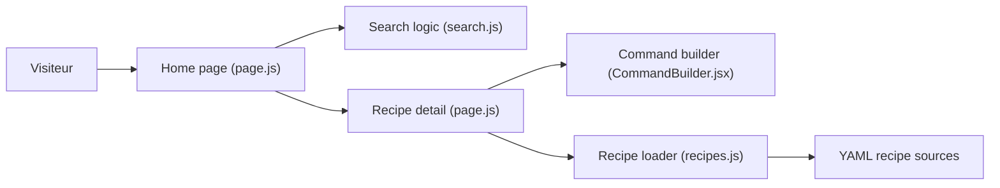

# vllm-project/recipes

> Recettes communautaires pour servir tel modèle sur tel matériel avec vLLM, avec générateur de commande.

## Le problème
Savoir quelles options vLLM utiliser pour un modèle donné sur un GPU donné demande de fouiller issues et forums.

## Ce que ça fait vraiment
Catalogue de guides par éditeur (DeepSeek, Qwen, Llama, GLM, Mistral, Kimi, gpt-oss, Gemma, etc.). Le site (Next.js) permet de chercher, ouvrir une fiche modèle, choisir des options et copier la commande générée. Un flux texte intégral des recettes existe. Les anciens guides MkDocs restent en référence.

## Comment c'est branché


## Essayer
```bash
uv venv
source .venv/bin/activate
uv pip install -r requirements.txt
uv run mkdocs serve --dev-addr 127.0.0.1:8001
```

## Coût et pièges
Gratuit, mais servir ces modèles exige des GPU. La commande donnée par le README sert à prévisualiser les anciens guides, pas le nouveau site. 183 issues ouvertes.

## Ce que ce n'est pas
Pas un serveur d'inférence : ce sont des recettes de configuration. Elles peuvent vieillir avec les versions de vLLM.

## Alternatives
Aucune alternative nommée dans le README.

## Pour toi
À adopter si tu sers des LLM avec vLLM : gain de temps direct, projet de l'organisation vLLM, activité récente.

