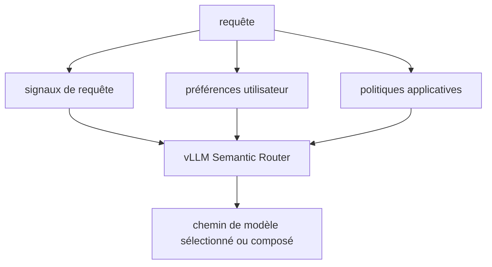

# vllm-project/semantic-router

> Couche de routage programmable qui choisit le modèle adapté à chaque requête LLM.

## Le problème
Le « meilleur » modèle change selon l'utilisateur, la charge, la localisation des données et le budget.
Coder ce choix dans l'application fige une décision qui devrait rester une politique.

## Ce que ça fait vraiment
Il évalue les signaux de la requête, les préférences utilisateur et les politiques applicatives pour sélectionner — ou composer — un chemin de modèle par requête.
Il couvre quatre axes annoncés : composer des chemins entre modèles spécialisés, router entre calculs hétérogènes (GPU, accélérateurs, edge, cloud), garder les données dans leur frontière, rendre chaque préférence exécutable.
L'objectif déclaré est d'agir sur qualité, coût, latence, confidentialité et sûreté sans écrire de logique de routage dans l'application.
Un playground en ligne est proposé avec des identifiants de lecture publics.

## Comment c'est branché


## Essayer
```bash
curl -fsSL https://vllm-sr.ai/install.sh | bash -s -- --channel stable
```
Le README renvoie au guide d'installation pour pip, uv ou l'installation pilotée par agent, sans donner ces commandes.

## Coût et pièges
L'installation passe par un script `curl | bash` sur un domaine tiers. Le playground public partage un compte en lecture, identifiants en clair dans le README.
Rien n'est dit sur les ressources nécessaires ni sur ce que coûte l'évaluation des signaux par requête.

## Ce que ce n'est pas
Ce n'est pas un moteur d'inférence : il route vers vLLM et consorts, il ne sert pas les modèles.
Et ce README ne suffit pas à juger : il s'arrête au playground, sans architecture, sans configuration, sans licence — matière insuffisante.

## Alternatives
Aucune alternative n'est nommée dans le README.

## Pour toi
Le sujet (Mixture-of-Models, politiques de routage) est exactement le tien, mais le README n'en dit pas assez pour décider.
