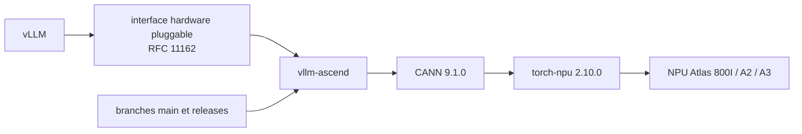

# vllm-project/vllm-ascend

> Plugin matériel communautaire pour faire tourner vLLM sur NPU Ascend, pour exploitants de matériel Huawei.

## Le problème
vLLM cible les GPU : sur NPU Ascend, il faudrait forker le moteur ou patcher le backend.
Un fork suit mal le rythme de vLLM en amont.

## Ce que ça fait vraiment
Implémente l'interface « hardware pluggable » décrite par la RFC de vLLM, ce qui découple
l'intégration du NPU Ascend du moteur lui-même : c'est l'approche recommandée par la communauté vLLM
pour le backend Ascend. Permet d'exécuter sans modification les modèles ouverts courants :
type Transformer, Mixture-of-Experts, embeddings, LLM multimodaux.
Deux lignes de branches : `main` suivie par la CI Ascend contre le `main` de vLLM, et
`releases/vX.Y.Z` créées à chaque release de vLLM. Un DeepWiki maintenu par la communauté et l'IA
documente l'architecture et les décisions.

## Comment c'est branché

## Essayer
Aucune commande d'installation dans le README : il renvoie au QuickStart et à l'Installation
des versions recommandées (v0.26.0rc1, v0.23.0).

## Coût et pièges
Gratuit, mais le prérequis est le matériel : séries Atlas 800I A2/A3, Atlas A2/A3 Training,
Atlas 300I Duo (expérimental). Chaîne de versions serrée : Python ≥ 3.10 et < 3.13, CANN 9.1.0,
PyTorch 2.10.0 avec TorchNPU 2.10.0.post4, et la même version de vLLM que le plugin.
Sans matériel, HiDevLab est proposé pour un accès en ligne.

## Ce que ce n'est pas
Ce n'est pas vLLM : sans vLLM installé à la même version, rien ne tourne.
Ce n'est pas maintenu par un éditeur : le README dit « community maintained ».
Ce n'est pas portable : c'est du NPU Ascend, point.

## Alternatives
vLLM lui-même, pour tout autre accélérateur.

## Pour toi
Sans objet sans NPU Ascend ; à retenir comme preuve que le modèle de plugin matériel de vLLM fonctionne.
