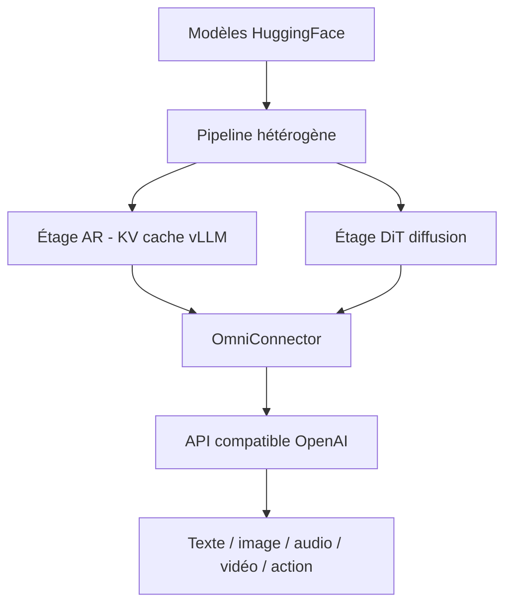

# vllm-project/vllm-omni

> Extension de vLLM pour servir des modèles omni-modaux (texte, image, audio, vidéo, action).

## Le problème
vLLM sert des LLM texte autorégressifs, mais ne couvre pas les architectures non-autorégressives (diffusion) ni les sorties multimodales et robotiques. Servir ces modèles demande des runtimes séparés.

## Ce que ça fait vraiment
Étend vLLM à l'omni-modalité : texte, image, audio, vidéo, action. Ajoute le support des Diffusion Transformers (DiT) au-delà de l'autorégressif. Sorties hétérogènes. Réutilise la gestion KV-cache de vLLM, exécution par étapes pipelinée, désagrégation via OmniConnector. Supporte Qwen3-Omni, MiniCPM-o, TTS (CosyVoice3…), diffusion (Wan2.2…), modèles robot-policy (π0, GR00T). API compatible OpenAI, serving full-duplex temps réel.

## Comment c'est branché

## Essayer
Aucune commande d'installation présente dans le README (renvoie vers la doc : Installation, Quickstart, images Docker CUDA nightly). L'écrire : voir la documentation du projet.

## Coût et pièges
Gratuit. GPU (CUDA/ROCm/NPU/XPU) et RAM conséquente requis. Runtime full-duplex temps réel marqué expérimental. Cadence de release alignée sur les versions paires de vLLM.

## Ce que ce n'est pas
Pas vLLM lui-même : une extension omni-modale. Pas un produit stabilisé sur tous les axes (plusieurs briques expérimentales).

## Alternatives
- vllm-project/vllm : l'amont, pour le texte seul.

## Pour toi
À suivre si tu sers des modèles multimodaux ou de diffusion en prod ; encore mouvant.
