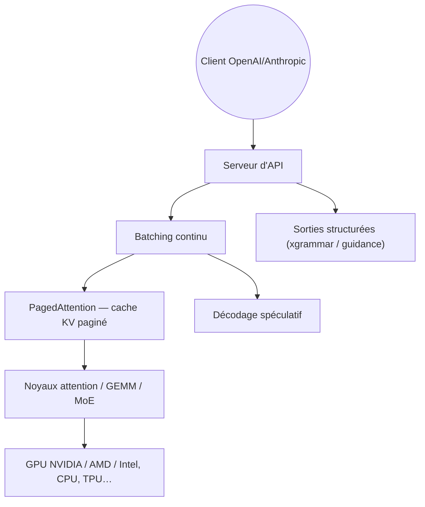

# vllm-project/vllm

> Moteur de service d'inférence LLM à haut débit, né au Sky Computing Lab de Berkeley.

## Le problème
Servir un LLM à plusieurs utilisateurs sature la mémoire GPU et effondre le débit.
La mémoire du cache attention est fragmentée et gaspillée si elle est allouée naïvement.

## Ce que ça fait vraiment
PagedAttention gère la mémoire clé/valeur par pages, comme une pagination mémoire système.
Batching continu des requêtes, prefill découpé, cache de préfixe, graphes CUDA/HIP partiels ou complets.
Quantisation FP8, MXFP8/MXFP4, NVFP4, INT8, INT4, GPTQ/AWQ, GGUF, compressed-tensors, TorchAO.
Décodage spéculatif (n-gram, suffix, EAGLE, DFlash) ; parallélisme tenseur, pipeline, données, experts, contexte.
Serveur compatible OpenAI, plus API Messages Anthropic et gRPC ; 200+ architectures Hugging Face.

## Comment c'est branché


## Essayer
```bash
uv pip install vllm
```

## Coût et pièges
Gratuit. Le coût est le matériel : un GPU avec assez de VRAM pour le modèle et son cache KV.
Les plugins matériels (TPU, Gaudi, Ascend, Apple Silicon) n'ont pas tous la même maturité.

## Ce que ce n'est pas
Pas un outil de poste de travail : l'installation et le réglage sont plus lourds qu'un runtime local simple.
Pas un fournisseur de modèles ni une interface de chat — c'est un moteur de service.
La quantisation abaisse la mémoire mais change la qualité ; rien ici ne l'évalue pour toi.

## Alternatives
- `ollama/ollama` : plus simple, pour un usage mono-utilisateur sur une machine.

## Pour toi
Le choix par défaut dès qu'il faut servir un modèle ouvert à plusieurs. À adopter.
