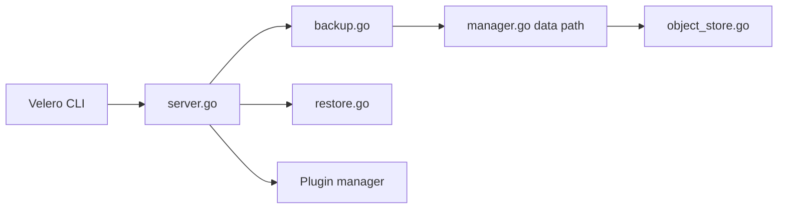

# vmware-tanzu/velero

> Outil de sauvegarde, restauration et migration des ressources et volumes d'un cluster Kubernetes.

## Le problème
Perdre un cluster ou devoir le recopier vers un autre sans sauvegarde cohérente des ressources et des volumes persistants.

## Ce que ça fait vraiment
Un serveur dans le cluster et une CLI locale. Sauvegarde et restaure ressources et volumes, planifie, appelle des hooks de restauration, déplace les données de volumes vers un stockage objet par plugins. Sert aussi à migrer ou répliquer un cluster vers dev/test.

## Comment c'est branché

## Essayer
Aucune commande dans le README : il renvoie à velero.io/docs.

## Coût et pièges
Gratuit ; le stockage objet de destination est à ta charge. Vérifier la matrice de compatibilité avec ta version de Kubernetes. 796 issues ouvertes.

## Ce que ce n'est pas
Pas une sauvegarde de base de données applicative. Le test de montée de version couvre n-2 versions mineures seulement.

## Alternatives
Aucune alternative nommée dans le README.

## Pour toi
À adopter si tes plateformes ML tournent sur Kubernetes : projet CNCF (sandbox), Apache-2.0, maintenu.

