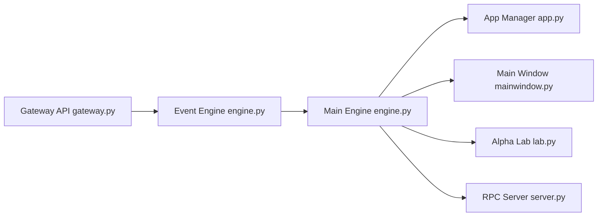

# vnpy/vnpy

> Framework Python de trading quantitatif (VeighNa) avec module de recherche par apprentissage automatique, pour traders et quants.

## Le problème
Brancher des courtiers, des sources de données et des stratégies dans un même système de trading demande beaucoup de code sur mesure, surtout sur les marchés chinois.

## Ce que ça fait vraiment
Un noyau événementiel (`EventEngine` et `MainEngine`) relie des passerelles de courtiers, des sources de données, des bases (SQLite, MySQL, PostgreSQL, MongoDB…) et une interface Qt. Des applications s'y greffent : stratégies CTA, backtest, options, algos d'exécution, gestion du risque, RPC. Le module `vnpy.alpha` enchaîne facteurs (Alpha 158), modèles (Lasso, LightGBM, MLP), stratégie et backtest. Les connecteurs de courtiers sont des paquets séparés.

## Comment c'est branché


## Essayer
```bash
bash install.sh          # Ubuntu ; install.bat sous Windows
python run.py
ruff check .
mypy vnpy
```

## Coût et pièges
Gratuit ; Python 3.10+ (3.13 conseillé), Windows 11+ ou Ubuntu 22.04+. Il faut un compte de simulation CTP (SimNow) et un compte du forum VeighNa ; les flux de données (RQData, Wind, iFinD…) sont de services tiers, souvent payants. Le README est en chinois.

## Ce que ce n'est pas
Pas un système clé en main pour gagner de l'argent : les avertissements du README portent sur l'adaptation des modules. Le cœur suppose les marchés et courtiers listés, surtout chinois.

## Alternatives
- Qlib : inspire `vnpy.alpha`, centré sur la recherche ML sans trading en direct.

## Pour toi
Surveiller : `vnpy.alpha` (facteurs, LightGBM, notebooks) est instructif pour un profil ML sur séries financières, mais l'ensemble reste tourné vers les marchés chinois.

