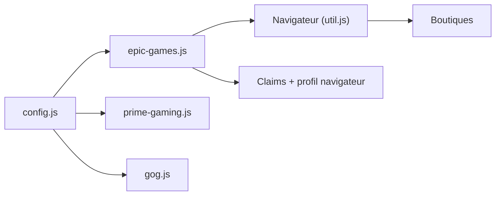

# vogler/free-games-claimer

> Scripts Playwright qui réclament périodiquement les jeux gratuits d'Epic, Prime Gaming, GOG et Unreal Engine.

## Le problème
Les jeux gratuits changent chaque semaine ou mois ; les réclamer à la main est répétitif.

## Ce que ça fait vraiment
Des scripts Node (`epic-games`, `prime-gaming`, `gog`, `unrealengine`) pilotent un Firefox via Playwright, se connectent à chaque boutique (identifiants, OTP optionnel), repèrent les offres gratuites et les ajoutent à ton compte. Les claims et clés sont enregistrés dans `data/`, avec captures d'écran, et des notifications partent via Apprise. Il faut programmer toi-même l'exécution (cron, tâche Windows, Compose).

## Comment c'est branché


## Essayer
```bash
docker run --rm -it -p 6080:6080 -v fgc:/fgc/data --pull=always ghcr.io/vogler/free-games-claimer
node epic-games
```

## Coût et pièges
Gratuit, mais tu confies identifiants et clés OTP à un script ; le README avertit du risque du texte clair. Captchas Epic en Docker (issue citée), violation possible des conditions d'usage des boutiques, 142 issues ouvertes. Licence AGPL-3.0.

## Ce que ce n'est pas
Pas un outil sûr pour un compte important. Aucun rapport avec la data ou l'IA.

## Alternatives
Non documenté dans le README (cite epicgames-freebies-claimer comme outil abandonné).

## Pour toi
À ignorer : hors de ton périmètre, et automatiser des connexions de comptes a un risque réel de blocage.

