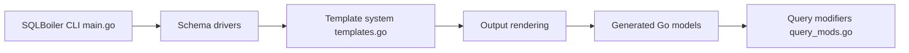

# volatiletech/sqlboiler

> Générateur Go d'ORM « database-first », en mode maintenance, à partir d'un schéma existant.

## Le problème
Écrire à la main le code `database/sql` répétitif et sans typage pour un schéma existant.

## Ce que ça fait vraiment
Lit le schéma d'une base (PostgreSQL, MySQL, MSSQL, SQLite via drivers) et génère des modèles Go typés avec requêtes, relations, eager loading, hooks, transactions et upsert. Régénérer avec `--wipe` est recommandé. Les benchmarks du README datent de Go 1.8.

## Comment c'est branché


## Essayer
```bash
go install github.com/aarondl/sqlboiler/v4@latest
go install github.com/aarondl/sqlboiler/v4/drivers/sqlboiler-psql@latest
sqlboiler psql
go test ./models
```

## Coût et pièges
Gratuit ; la configuration `sqlboiler.toml` est obligatoire. Chaque table doit avoir une clé primaire. Les tests générés sont fragiles.

## Ce que ce n'est pas
En maintenance : pas de nouvelles fonctionnalités, issues rarement traitées. Le README renvoie vers des projets plus actifs.

## Alternatives
Bob (inspiré par SQLBoiler, activement maintenu) ; sqlc (génère du code typé depuis du SQL, sans ORM).

## Pour toi
À ignorer : outil Go, en maintenance, sans lien avec le travail data/IA.

