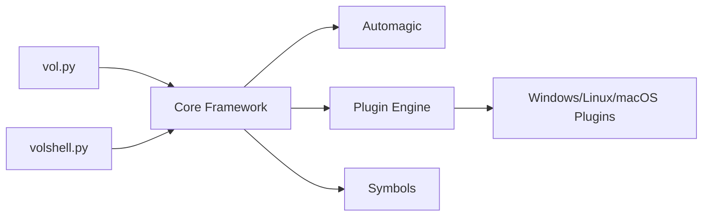

# volatilityfoundation/volatility3

> Framework Python d'analyse forensique de la mémoire vive, pour enquêteurs et analystes en réponse à incident.

## Le problème
Après un incident, l'état d'une machine en mémoire (processus, connexions, modules) disparaît à l'extinction. Il faut l'extraire d'un dump sans dépendre du système suspect.

## Ce que ça fait vraiment
Lit un échantillon mémoire et exécute des plugins par système (Windows, Linux, macOS). Les couches mémoire et la détection automatique (automagic) préparent le contexte ; les tables de symboles traduisent les structures brutes. Windows : symboles téléchargés à la demande. Linux et macOS : tables à produire, par exemple avec dwarf2json. Réécriture complète de 2019, sous Volatility Software License, licence personnalisée.

## Comment c'est branché


## Essayer
```bash
pip install volatility3
vol -h
vol -f /home/user/samples/stuxnet.vmem windows.info
```

## Coût et pièges
Gratuit. Python 3.8+. Le premier passage sur un pack de symboles met le cache à jour, ce qui peut être long. Analyser uniquement des échantillons dont on a le droit de disposer.

## Ce que ce n'est pas
Pas un outil d'acquisition de mémoire : il analyse des dumps existants. La licence VSL n'est pas reconnue par GitHub : à lire avant redistribution.

## Alternatives
Aucune alternative nommée dans le README (la version historique Volatility 2 est évoquée).

## Pour toi
Surveiller : utile si tu fais de la réponse à incident sur infra ML, sinon hors périmètre ; vérifier la licence VSL d'abord.

