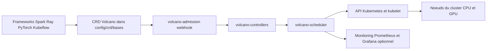

# volcano-sh/volcano

> **Batch scheduler for Kubernetes**, for teams running distributed training, Spark and HPC jobs there.

## The problem

The stock `kube-scheduler` places pods one at a time: a distributed training job that needs all
eight of its workers at once can sit half-started, holding resources other jobs are waiting for.
Batch, AI/ML/DL, bioinformatics and "Big Data" workloads need group guarantees, queues and
sharing policies the default scheduler does not provide.

## What it actually does

Volcano is a Kubernetes-native batch scheduling system that extends and enhances the
`kube-scheduler`. It installs as a set of components in the `volcano-system` namespace: a
scheduler, controllers and an admission webhook, plus CRDs describing the batch objects. The
README states the scheduler is built on `kubernetes-sigs/kube-batch`. Volcano does not run the
frameworks itself: it decides *where* and *when* their pods run, and integrates upstream with
Spark, Flink, Ray/KubeRay, PyTorch, TensorFlow, Kubeflow (trainer v2, training-operator v1,
arena), MPI, Horovod, MindSpore, PaddlePaddle, MXNet, Argo, KubeGene, LeaderWorkerSet and
Kthena. Optional pieces exist: the Volcano agent for colocation, a Prometheus/Grafana
monitoring stack, and a separate dashboard. The README claims "powerful and flexible" in
marketing terms that nothing in the text measures — read it as a slogan, not as data. The
scheduling policies themselves (gang scheduling, preemption, HyperNode network topology) appear
only in the titles of the linked conference talks, not in the README.

## How it is wired



No code-derived diagram exists for this repository: the graph above is inferred from the README
alone. Frameworks submit objects described by the Volcano CRDs (`config/crd/bases` for
Kubernetes 1.17+, `config/crd/v1beta1` for 1.16 and below, marked deprecated). The admission
webhook validates them, the controllers materialise the objects, and the scheduler makes the
placement decisions Kubernetes then applies on the nodes. Monitoring is a separate manifest,
`installer/volcano-monitoring.yaml`.

## Trying it

```bash
kubectl apply -f https://raw.githubusercontent.com/volcano-sh/volcano/master/installer/volcano-development.yaml
```

```bash
helm repo add volcano-sh https://volcano-sh.github.io/helm-charts
helm install volcano volcano-sh/volcano -n volcano-system --create-namespace
```

```bash
helm install volcano installer/helm/chart/volcano --namespace volcano-system --create-namespace
helm list -n volcano-system
```

```bash
./hack/local-up-volcano.sh
```

```bash
kubectl create -f installer/volcano-monitoring.yaml
```

## Cost and traps

The software is free under Apache-2.0; the real cost is the Kubernetes cluster and the GPUs you
give it to schedule. Stated prerequisite: Kubernetes 1.12+ with CRD support, but the
compatibility table in practice only covers 1.21 to 1.36 depending on the Volcano release —
check the matching row before installing, since a too-recent Kubernetes is not covered by older
releases. The YAML manifest works on x86_64 and arm64; installing from source
(`hack/local-up-volcano.sh`) is described as "only available for x86_64 temporarily". A version
trap: picking the wrong CRD directory (deprecated `v1beta1`) on a recent cluster. The Volcano
agent, the dashboard and monitoring are separate installs, each with its own guide. The README
documents neither the resource footprint of the components nor an uninstall or migration path.

## What it is not

It is not an execution engine or an ML platform: Volcano does not launch training, it places
the pods Spark, PyTorch or Ray produce — so those operators must already be in place. It is not
a replacement for `kube-scheduler` for your ordinary microservices either: it complements it for
batch workloads. And it is not a turnkey product outside Kubernetes: with no existing cluster
there is nothing to install, and the README does not explain day-to-day operation (tuning
queues and policies, debugging a job that will not start) — all of that points to the website
documentation.

## Alternatives

No direct competitor is named in the README; `kubernetes-sigs/kube-batch` appears there as the
scheduler's ancestor, not as an option to weigh. Among the supplied neighbours: `kserve/kserve`
covers inference serving on Kubernetes, the other end of the lifecycle rather than batch
scheduling; `loft-sh/vcluster` isolates virtual clusters and answers the multi-team sharing
problem through partitioning instead of queues; `Netflix/metaflow` orchestrates data workflows
at the pipeline level without touching pod placement. None is a substitute — they sit at
different layers of the stack.

## For you

If you operate distributed training or Spark jobs on Kubernetes and see GPUs idled by
half-started jobs, this is the missing layer in your stack: a CNCF incubating project, foundation
governance, and documented integrations with most of the operators you already use. If you have
no Kubernetes cluster, or you work on a single machine, walk past: none of this applies.
