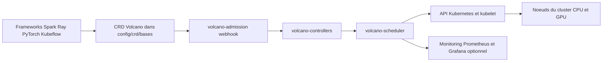

# volcano-sh/volcano

> **Ordonnanceur batch pour Kubernetes**, destiné aux équipes qui y font tourner entraînements distribués, Spark et HPC.

## Le problème

Le `kube-scheduler` standard place les pods un par un : un entraînement distribué qui a besoin
de ses huit workers en même temps peut rester à moitié démarré et bloquer les ressources des
autres jobs. Les charges batch, AI/ML/DL, bio-informatique et « Big Data » demandent des
garanties de groupe, des files d'attente et des politiques de partage que le planificateur par
défaut ne fournit pas.

## Ce que ça fait vraiment

Volcano est un système d'ordonnancement batch natif Kubernetes qui étend et complète le
`kube-scheduler`. Il se déploie comme un jeu de composants dans le namespace `volcano-system` :
un scheduler, des controllers et un webhook d'admission, plus des CRD qui décrivent les objets
batch. Le README indique que le scheduler dérive de `kubernetes-sigs/kube-batch`. Volcano
n'exécute pas les frameworks lui-même : il décide *où* et *quand* leurs pods tournent, et
s'intègre en amont avec Spark, Flink, Ray/KubeRay, PyTorch, TensorFlow, Kubeflow (trainer v2,
training-operator v1, arena), MPI, Horovod, MindSpore, PaddlePaddle, MXNet, Argo, KubeGene,
LeaderWorkerSet et Kthena. Des composants optionnels existent : agent Volcano pour la
colocation, stack de monitoring Prometheus/Grafana, dashboard séparé. Le README revendique une
« puissance » et une « flexibilité » en termes marketing que rien dans le texte ne mesure — à
prendre comme un slogan, pas comme une donnée. Le détail des politiques d'ordonnancement
(gang scheduling, préemption, topologie réseau HyperNode) n'apparaît que dans les titres de
conférences citées, pas dans le README lui-même.

## Comment c'est branché



Aucun diagramme tiré du code n'existe pour ce dépôt : ce schéma est déduit du README seul. Les
frameworks soumettent des objets décrits par les CRD Volcano (`config/crd/bases` pour
Kubernetes 1.17+, `config/crd/v1beta1` pour 1.16 et moins, marqué déprécié). Le webhook
d'admission les valide, les controllers matérialisent les objets, le scheduler prend les
décisions de placement que Kubernetes applique ensuite sur les nœuds. Le monitoring est un
manifeste à part, `installer/volcano-monitoring.yaml`.

## Essayer

```bash
kubectl apply -f https://raw.githubusercontent.com/volcano-sh/volcano/master/installer/volcano-development.yaml
```

```bash
helm repo add volcano-sh https://volcano-sh.github.io/helm-charts
helm install volcano volcano-sh/volcano -n volcano-system --create-namespace
```

```bash
helm install volcano installer/helm/chart/volcano --namespace volcano-system --create-namespace
helm list -n volcano-system
```

```bash
./hack/local-up-volcano.sh
```

```bash
kubectl create -f installer/volcano-monitoring.yaml
```

## Coût et pièges

Le logiciel est gratuit sous Apache-2.0 ; le coût réel est celui du cluster Kubernetes et des
GPU qu'on lui donne à ordonnancer. Prérequis annoncé : Kubernetes 1.12+ avec support des CRD,
mais le tableau de compatibilité ne couvre en pratique que 1.21 à 1.36 selon les versions de
Volcano — vérifier la ligne correspondante avant d'installer, une version trop récente de
Kubernetes n'est pas couverte par les releases anciennes. Le manifeste YAML fonctionne en
x86_64 et arm64 ; l'installation depuis le code (`hack/local-up-volcano.sh`) est décrite comme
« only available for x86_64 temporarily ». Piège de version : se tromper de répertoire de CRD
(`v1beta1` déprécié) sur un cluster récent. Agent Volcano, dashboard et monitoring sont des
installations supplémentaires, chacune avec son guide. Le README ne documente ni la
consommation de ressources des composants, ni de procédure de désinstallation ou de migration.

## Ce que ce n'est pas

Ce n'est pas un moteur d'exécution ni une plateforme ML : Volcano ne lance pas d'entraînement,
il place des pods que Spark, PyTorch ou Ray produisent — il faut donc déjà avoir ces opérateurs
en place. Ce n'est pas non plus un remplaçant du `kube-scheduler` pour vos microservices
habituels : il le complète pour les charges batch. Enfin ce n'est pas un produit clé en main
hors Kubernetes : sans cluster existant, il n'y a rien à installer, et le README n'explique pas
comment l'exploiter au quotidien (réglage des files, des politiques, débogage d'un job qui ne
démarre pas) — tout cela renvoie à la documentation du site.

## Alternatives

Aucun concurrent direct n'est nommé dans le README ; `kubernetes-sigs/kube-batch` y figure mais
comme ancêtre du scheduler, pas comme option à comparer. Parmi les voisins fournis :
`kserve/kserve` couvre le service d'inférence sur Kubernetes, donc l'autre bout du cycle de vie
plutôt que l'ordonnancement batch ; `loft-sh/vcluster` isole des clusters virtuels et répond au
problème du partage multi-équipes par le cloisonnement au lieu des files d'attente ;
`Netflix/metaflow` orchestre des workflows data au niveau du pipeline, sans se mêler du
placement des pods. Aucun n'est un substitut : ce sont des étages différents de la pile.

## Pour toi

Si tu opères des entraînements distribués ou des jobs Spark sur Kubernetes et que tu vois des
GPU immobilisés par des jobs à moitié démarrés, c'est l'étage qui manque à ta pile : projet
CNCF en incubation, gouvernance de fondation, intégrations documentées avec la plupart des
opérateurs que tu utilises déjà. Si tu n'as pas de cluster Kubernetes, ou si tu travailles sur
une seule machine, passe ton chemin : rien ici ne s'applique.
