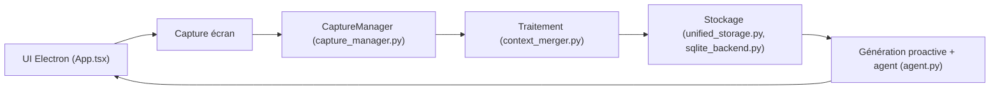

# volcengine/MineContext

> Application de bureau qui capture ton écran et en tire résumés, to-dos et activités, pour travailleurs du savoir.

## Le problème
Le contexte numérique d'une journée de travail est dispersé ; le retrouver ou en tirer des synthèses demande un effort manuel.

## Ce que ça fait vraiment
Elle prend des captures d'écran à intervalle réglable (5 s dans l'exemple), les interprète avec un modèle vision-langage, calcule des embeddings, stocke en local (SQLite, ChromaDB) et génère résumés quotidiens/hebdo, tips et todos sur la page d'accueil ; un chat permet de questionner ce contexte. Frontend Electron/React, backend FastAPI. Modèles Doubao, OpenAI ou tout service compatible OpenAI, y compris local.

## Comment c'est branché


## Essayer
```bash
uv sync
source .venv/bin/activate
uv run opencontext start --port 1733
```

## Coût et pièges
Clé d'API VLM + embeddings à ta charge (Doubao recommandé par le README) ; permission d'enregistrement d'écran requise. Les captures partent vers le fournisseur si le modèle n'est pas local. Le chemin de données cité est celui de macOS.

## Ce que ce n'est pas
Les sources autres que l'écran et les notes (fichiers, liens, MCP) sont au stade de feuille de route. Le « local-first » ne vaut que si tu branches un modèle local.

## Alternatives
Dayflow et ChatGPT Pulse sont comparés dans le README ; MineContext se présente comme plus riche et ouvert.

## Pour toi
Curieux pour l'ingénierie de contexte, mais capture d'écran continue vers une API tierce : à tester seulement avec un modèle local (LMStudio) et hors données sensibles.

