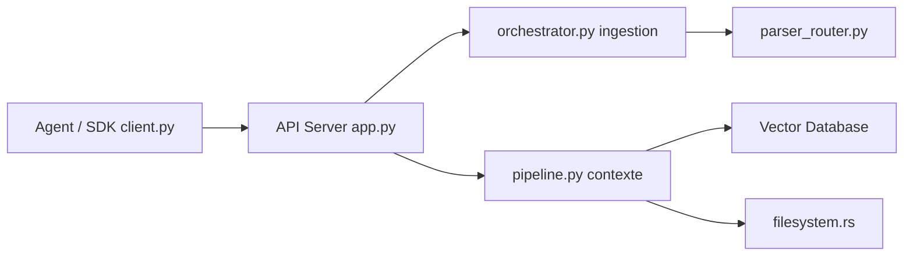

# volcengine/OpenViking

> Base de contexte pour agents IA, organisée en système de fichiers virtuel inspectable.

## Le problème
La mémoire d'un agent est souvent une boîte noire d'embeddings qu'on ne peut ni lire ni corriger.

## Ce que ça fait vraiment
Ressources, mémoires et skills rangées sous `viking://`, navigables avec `ls`, `tree`, `grep`, `find`. Chaque répertoire porte un résumé L0 et une vue L1 générés, le contenu complet (L2) n'est lu qu'au besoin. Recherche vectorielle limitée à un sous-arbre, sessions archivées et mémoires extraites en Markdown. Serveur, CLI `ov`, SDK Python/Go/TS, MCP.

## Comment c'est branché


## Essayer
```bash
pip install openviking --upgrade
openviking-server init
openviking-server
ov add-resource https://github.com/volcengine/OpenViking
ov find "what is openviking"
```

## Coût et pièges
Exige un modèle d'embedding et un VLM (cloud ou Ollama local). AGPL-3.0 ; éditions commerciales en parallèle. Configurer l'authentification avant d'exposer le serveur.

## Ce que ce n'est pas
Pas une base vectorielle générique. Les benchmarks cités sont ceux de l'éditeur, avec ses propres modèles Doubao.

## Alternatives
Aucune nommée comme alternative (deer-flow, Hermes Agent sont des partenaires).

## Pour toi
Approche mémoire lisible pertinente pour du RAG d'agents : à surveiller de près.
