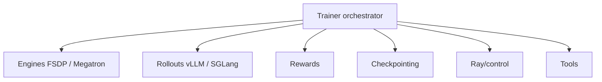

# volcengine/verl

> Bibliothèque d'entraînement par renforcement (PPO, GRPO…) de grands modèles de langage, issue de ByteDance Seed.

## Le problème
L'entraînement RL de LLM enchaîne génération, récompense et mise à jour sur beaucoup de GPU, ce qui gaspille mémoire et communication.

## Ce que ça fait vraiment
Un contrôleur orchestre la boucle prompts, génération (vLLM, SGLang, Transformers), récompense, avantages, mise à jour de l'acteur et du critique, checkpoint. Backends d'entraînement FSDP/FSDP2, Megatron-LM et autres, orchestration Ray. Récompenses vérifiables ou par modèle, appels d'outils multi-tours, LoRA, suivi wandb ou mlflow, support NVIDIA, AMD, Ascend.

## Comment c'est branché


## Essayer
```text
actor_rollout_ref.ref.strategy=fsdp2
actor_rollout_ref.actor.strategy=fsdp2
critic.strategy=fsdp2
```
(Options de configuration du README ; l'installation renvoie à la documentation.)

## Coût et pièges
Beaucoup de GPU pour des modèles réalistes. Éviter vLLM 0.7.x (bugs de mémoire selon le README). Les recettes sont épinglées à des versions précises.

## Ce que ce n'est pas
Pas un outil de fine-tuning supervisé simple : c'est un cadre de RL distribué. Aucune commande d'installation dans l'extrait.

## Alternatives
- Aucune alternative nommée dans le README.

## Pour toi
À surveiller : référence pour le RL de LLM (GRPO, DAPO…) si tu as des GPU ; peu utile en dessous de plusieurs cartes.
