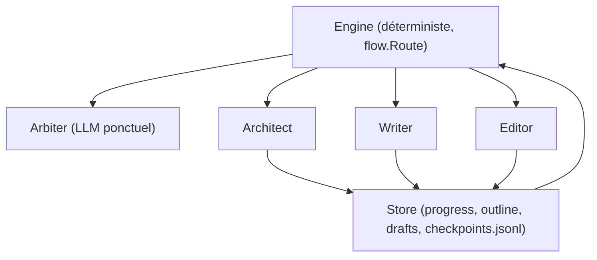

# voocel/ainovel-cli

> Moteur déterministe qui écrit un roman entier en pilotant trois agents créatifs autonomes.

## Le problème
Confier un livre de 500 chapitres à une boucle d'agents produit des incohérences, des
intrigues oubliées et un plan creux dès le centième chapitre.

## Ce que ça fait vraiment
Sépare strictement le factuel du sémantique. Un Engine déterministe lit l'état depuis un
Store, consulte une table de décision `flow.Route` (fonction pure, testée par énumération) et
dispatche sans consommer un seul appel LLM. Trois Workers autonomes ont chacun leur contexte :
Architect (titre, prémisse, plan, personnages, règles du monde), Writer (plan → brouillon →
vérification de cohérence → commit, dans cet ordre imposé), Editor (relecture structurelle et
esthétique sur sept dimensions, chaque point devant citer le texte). Un Arbiter est réveillé
ponctuellement pour les jugements bornés, et chaque arbitrage est écrit sur disque, rejouable.
Planification en rouleau : seuls deux volumes et le premier arc sont détaillés au départ, la
suite est développée à mesure. Reprise au niveau du *step* grâce à un checkpoint écrit après
chaque outil réussi.

## Comment c'est branché


## Essayer
```bash
curl -fsSL https://raw.githubusercontent.com/voocel/ainovel-cli/main/scripts/install.sh | sh
go install github.com/voocel/ainovel-cli/cmd/ainovel-cli@latest
ainovel-cli
ainovel-cli --headless --prompt "写一本东方玄幻长篇，主角从边陲小城起步"
docker run --rm -it -v "$PWD/config:/root/.ainovel" -v "$PWD/workspace:/workspace" ghcr.io/voocel/ainovel-cli:latest
```

## Coût et pièges
Le programme est gratuit, les tokens non : écrire 500 chapitres avec un modèle de pointe se
chiffre. Le README est intégralement en chinois. Configuration dans `~/.ainovel/config.json`,
surchargeable par projet ; le mode headless n'a pas d'assistant de première configuration.
Les modèles se règlent par rôle (`writer`, `architect`, `editor` et trois étages du pipeline
d'import), ce qui permet de mettre le moins cher sur le découpage mécanique.

## Ce que ce n'est pas
Ce n'est pas un assistant d'écriture conversationnel : l'intervention se fait par injection
d'une consigne que l'Arbiter trie, pas par dialogue. Ce n'est pas un orchestrateur générique —
pas de file de tâches, pas de moteur de politique, revendiqué comme tel. Et l'import d'un
roman existant sert à le continuer, pas à s'en inspirer.

## Alternatives
- Aucune alternative nommée dans le README.

## Pour toi
Peu utile en data, mais l'architecture « couche factuelle déterministe, couche sémantique
autonome » est un patron à voler pour tes propres pipelines d'agents.
