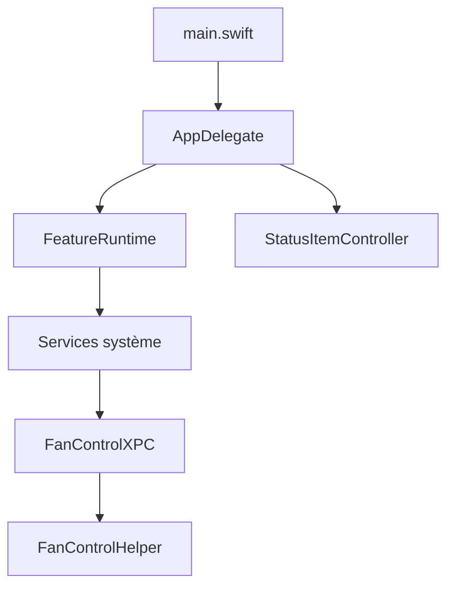

# vorssaint/vorssaint-utils

> Suite d'utilitaires macOS dans la barre de menus, locale et sans compte, pour utilisateurs de Mac Apple Silicon.

## Le problème
Les petits utilitaires Mac (mixeur audio, moniteur système, presse-papiers, capture, désinstalleur) s'achètent un par un, chacun avec son icône et son abonnement.

## Ce que ça fait vraiment
Une seule application Swift regroupe des dizaines de fonctions : volume par application, moniteur CPU/GPU/températures, commutateur d'applications, placement de fenêtres, historique du presse-papiers, captures et enregistrements d'écran, désinstalleur, gestion Homebrew. Les fonctions s'installent à la carte. Le contrôle des ventilateurs passe par un assistant privilégié séparé via XPC. Aucun compte, aucune télémétrie ; le réseau n'est touché que pour des actions visibles.

## Comment c'est branché


## Essayer
```bash
brew install --cask vorssaint
./build.sh --dev
./build.sh --dev --install
```

## Coût et pièges
Gratuit. Exige Apple Silicon et macOS 14+. Beaucoup de permissions (Accessibilité, capture d'écran) mais toutes optionnelles. Le nom et l'icône sont soumis à TRADEMARKS.md.

## Ce que ce n'est pas
Ce n'est pas portable hors macOS, ni un outil de développement ou de data.

## Alternatives
Le README ne nomme pas d'alternatives précises, seulement « une dizaine d'applications payantes ».

## Pour toi
À ignorer pour ton métier : utilitaire de confort pour poste Mac, sans lien avec données, IA ou MLOps.

