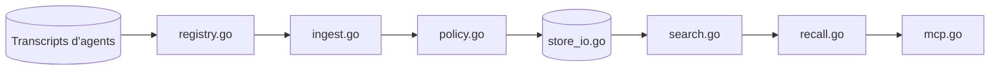

# vshulcz/deja-vu

> Index local qui rend l'historique de tous tes agents de code cherchable et rappelable.

## Le problème
Chaque agent (Claude Code, Codex, Cursor…) garde ses transcripts dans son coin et oublie d'une session à l'autre ; une solution trouvée dans l'un est perdue pour les autres.

## Ce que ça fait vraiment
Binaire Go qui lit en place les transcripts JSONL et SQLite de 35 agents, masque les secrets reconnus et construit un index inversé incrémental dans `~/.cache/deja`.
Recherche lexicale sans modèle ni serveur ; embeddings optionnels via Ollama, LM Studio ou un endpoint OpenAI-compatible.
Un serveur MCP (un seul outil `deja`, modes recall, context, blame, fix, how…) et des hooks qui injectent le rappel en début de session, avant une édition ou après un échec.
CLI : `deja blame`, `deja fix`, `deja wip`, synchro SSH entre machines, `deja secrets --scrub`.

## Comment c'est branché


## Essayer
```bash
curl -fsSL https://raw.githubusercontent.com/vshulcz/deja-vu/main/install.sh | sh
deja install --auto
deja "jwt refresh token"
deja doctor
deja uninstall --all
rm -rf ~/.cache/deja
```

## Coût et pièges
Gratuit et local ; le réseau ne sert qu'aux mises à jour, à la synchro SSH et aux embeddings si tu les configures. `deja install --auto` écrit des consignes dans le fichier global de chaque agent détecté (`--no-guidance` pour l'éviter). Index de l'ordre de 4 à 10 % du corpus.

## Ce que ce n'est pas
Pas une détection de secrets : le masquage repose sur des motifs connus, une forme inconnue peut passer ; les transcripts d'origine gardent leurs secrets.
Chiffres de précision et d'économie de tokens mesurés par l'auteur, sur ses propres bancs.
Windows moins éprouvé que macOS et Linux.

## Alternatives
- engram : si tu préfères une mémoire où l'agent enregistre explicitement ses faits.
- Mem0 / Letta : plateformes de mémoire, capture par l'agent et clé LLM requise.
- cass : recherche de sessions, sans rappel automatique.

## Pour toi
À adopter si tu jongles entre plusieurs agents de code : local, réversible, utile dès le premier jour.
