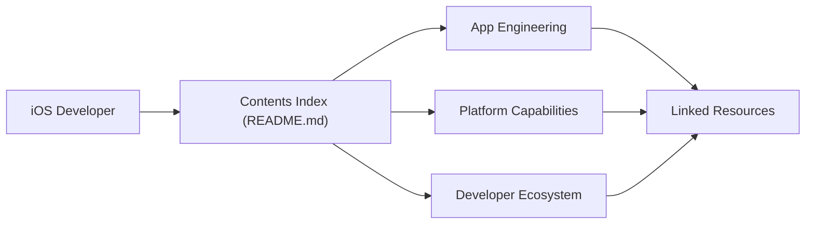

# vsouza/awesome-ios

> Catalogue classé de bibliothèques, outils et ressources pour développer des apps iOS en Swift ou Objective-C.

## Le problème
L'écosystème iOS compte des milliers de bibliothèques tierces dispersées. Sans index, on ne sait pas quelle brique existe pour le réseau, le cache ou l'UI.

## Ce que ça fait vraiment
Un seul README organisé en une centaine de rubriques (Analytics, Networking, Database, Testing, Security, UI, Xcode…), chacune avec des liens et une ligne de description. Aucun code exécutable : le seul Swift échantillonné est un « hello » sans rapport. La liste contient des doublons dans les rubriques Image et Animation, et la rubrique « EventBus » décrit des bibliothèques de promesses (Promises/Futures).

## Comment c'est branché

## Essayer
Aucune commande documentée. On ouvre le README et on suit les liens de la rubrique voulue.

## Coût et pièges
Gratuit, rien à installer. Attention : la liste est très longue, beaucoup d'entrées sont anciennes (Swift 2/3, Objective-C) et rien n'indique laquelle est encore maintenue.

## Ce que ce n'est pas
Ce n'est ni un framework ni un comparatif : aucune évaluation de qualité, aucun classement. Ce n'est pas non plus une source fiable de compatibilité avec les versions récentes d'iOS.

## Alternatives
- Swift Package Index (cité dans la rubrique Tools) : donne des infos de qualité et de compatibilité par paquet.
- Awesome-Swift-Education (cité dans Tutorials) : pour apprendre plutôt que chercher une brique.

## Pour toi
À ignorer : c'est du développement mobile Apple, hors périmètre data/IA/MLOps ; seule la rubrique Machine Learning (CoreML-Models, iOS-GenAI-Sampler, off-grid-mobile) touche ton domaine.

