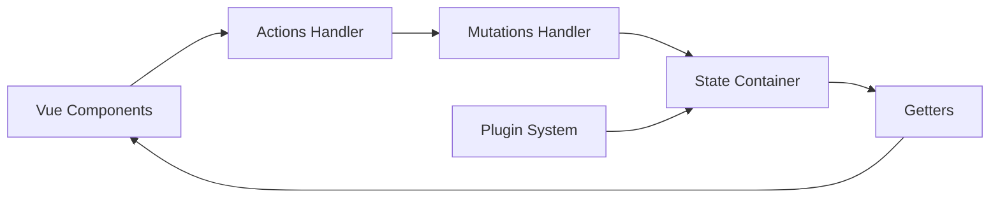

# vuejs/vuex

> Bibliothèque de gestion d'état centralisée pour Vue.js, désormais supplantée par Pinia.

## Le problème
Dans une appli Vue, partager et modifier un état entre composants de façon prévisible devient vite ingérable sans convention.

## Ce que ça fait vraiment
Un store centralisé (state, getters, mutations synchrones, actions asynchrones, modules) avec plugins et intégration aux devtools de Vue pour le débogage par voyage dans le temps. Le README annonce que Pinia est le nouveau choix par défaut ; Vuex 3 et 4 restent maintenus mais sans nouvelles fonctions.

## Comment c'est branché


## Essayer
```bash
npm install
npm run dev
```
(commandes du README pour servir les exemples sur localhost:8080)

## Coût et pièges
Gratuit. Dernier push le 2024-09-25, soit plus d'un an ; le README recommande Pinia pour tout nouveau projet.

## Ce que ce n'est pas
Ce n'est plus le choix recommandé pour démarrer. Ce n'est pas un outil hors de l'écosystème Vue.

## Alternatives
- Pinia : successeur officiel, API proche de Vuex 5, fonctionne aussi avec Vue 2.

## Pour toi
Ignorer : bibliothèque front en maintenance seule, sans lien avec ton métier ; si tu fais du Vue, prends Pinia.

