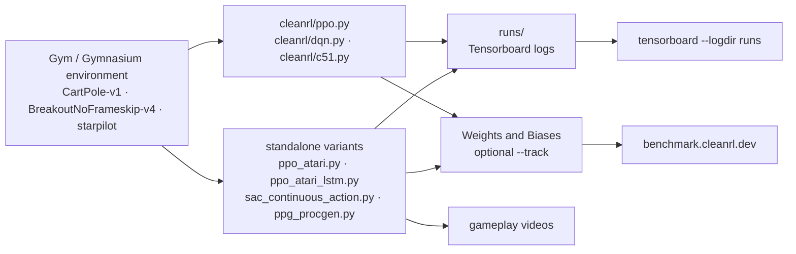

# vwxyzjn/cleanrl

> **Deep reinforcement learning algorithms written one per standalone file, meant to be read and copied rather than imported.**

## The problem

Working out why a given PPO implementation reaches a given score means knowing dozens of small
details that a modular library scatters across base classes, wrappers and config files. You
spend the day climbing inheritance chains instead of reading the algorithm, and prototyping a
variant the framework did not anticipate forces you to subclass three levels up.

## What it actually does

CleanRL inverts the trade-off: *one standalone file per algorithm variant*. The README's own
example is `ppo_atari.py`, 340 lines, holding every implementation detail of PPO on Atari —
training loop, network, observation handling, logging. The accepted price is duplication:
`ppo.py`, `ppo_atari.py`, `ppo_atari_lstm.py` and `ppo_procgen.py` all repeat the same
scaffolding.

The catalogue covers PPO, DQN, C51, SAC, DDPG, TD3, PPG, RND and Qdagger, often in several
variants (PyTorch and JAX, Atari, continuous control, multi-GPU, multi-agent PettingZoo,
Isaac Gym, transformer-XL). Each script takes an `--env-id` plus hyperparameters as
command-line arguments, and carries the four conveniences the README lists: Tensorboard
logging, reproducibility through seeding (`--seed`), gameplay video capture, and optional
experiment tracking to Weights and Biases (`--track`). Benchmarked results are published
(7+ algorithms, 34+ games) and contributed to Open RL Benchmark.

## How it is wired



No code-derived diagram exists for this repository: the graph above is reconstructed from the
README alone. The point is what it does **not** contain — there is no shared central component
between `ppo.py` and `dqn.py`. Each file goes from environment to log on its own; they only
agree on argument conventions and the `runs` directory.

## Trying it

```bash
git clone https://github.com/vwxyzjn/cleanrl.git && cd cleanrl
uv pip install .

# alternatively, you could use `uv venv` and do
# `python run cleanrl/ppo.py`
uv run python cleanrl/ppo.py \
    --seed 1 \
    --env-id CartPole-v0 \
    --total-timesteps 50000

# open another terminal and enter `cd cleanrl/cleanrl`
tensorboard --logdir runs
```

Without `uv`, the README gives `pip install -r requirements/requirements.txt`, plus one
requirements file per extra. For Atari and experiment tracking:

```bash
uv pip install ".[atari]"
python cleanrl/dqn_atari.py --env-id BreakoutNoFrameskip-v4

wandb login # only required for the first time
uv run python cleanrl/ppo.py \
    --seed 1 \
    --env-id CartPole-v0 \
    --total-timesteps 50000 \
    --track \
    --wandb-project-name cleanrltest
```

## Cost and pitfalls

- **Narrow Python window**: the README requires `Python >=3.7.1,<3.11` and `uv 0.7.9+`. The
  upper bound is the real trap — a recent environment falls outside the stated support.
- **Licence**: the README shows an MIT badge, but the catalogue records `NOASSERTION`, meaning
  GitHub could not identify the licence file. The intent is clear, the verification is not:
  check the repository's `LICENSE` before any internal use. That residual doubt is why the
  alert is kept.
- **The real cost is compute**, not installation. CartPole runs on a laptop; Atari, Procgen and
  MuJoCo are measured in GPU hours. The README mentions learning Pong in "~5-10 mins" via
  envpool, and thanks Google's TPU Research Cloud and Hugging Face's cluster for the resources
  behind the benchmark campaigns — an order of magnitude no single machine reaches.
- **Weights and Biases is optional**: `--track` needs an account, `wandb login` and a key.
  Local Tensorboard is enough and remains the default path.
- **Many extras**: `atari`, `envpool` (Linux only), `procgen`, `mujoco`, `jax`, `pettingzoo` —
  each with its own requirements file, installed separately.
- **Gym to Gymnasium migration in progress** at the time of the README, tracked in an open pull
  request: depending on the variant, the expected environment API may differ.

## What it is not

- **It is not a library you import.** The README says so outright: CleanRL is *not* modular and
  is not meant to be imported. There is no `from cleanrl import PPO`; you copy `ppo.py` into
  your project and edit it. Duplication between files is a deliberate choice, not debt awaiting
  a refactor.
- **It is therefore not a foundation for a service**: no stable API, no single entry point, no
  component versioning. The code you copy becomes yours, upstream updates included — that is,
  not included.
- **It is not a set of environments or tasks**: those come from Gym / Gymnasium, Atari, Procgen,
  MuJoCo and PettingZoo, installed alongside.
- **It is not a shortcut to a trained agent**: the scripts train, they do not ship a ready
  policy (models are published on Hugging Face, separately).

## Alternatives

| | When to pick it instead |
|---|---|
| **DLR-RM/stable-baselines3** | Named in the README under Open RL Benchmark, and the comparison that matters: a modular library whose algorithms you instantiate and reuse from your own code. Pick it when you want to *use* an algorithm without reading it; pick CleanRL when you want to read and change it line by line. |
| **pytorch-labs/LeanRL** | Listed as a related project: CleanRL's algorithms reimplemented as optimised PyTorch with CUDAGraphs. Pick it when training time matters more than readability. |
| **corl-team/CORL** | Listed as a related project: the same single-file stance, but for *offline* reinforcement learning, which CleanRL does not cover. |

The other catalogue neighbours (`PennyLaneAI/pennylane`, `d2l-ai/d2l-en`,
`recommenders-team/recommenders`) are not comparable — unrelated to deep reinforcement learning.

## For you

Worth adopting, but not as a dependency: as reading material and a starting point. It is the
shortest reference for seeing *every* detail of an algorithm variant — precisely what you want
when a training run will not converge and you suspect an implementation detail. With seeding,
Tensorboard and wandb tracking already wired into each file, it also doubles as a template for
experimental discipline that transfers outside RL. Skip it if the goal is to put an agent into
service: take a modular library instead.
