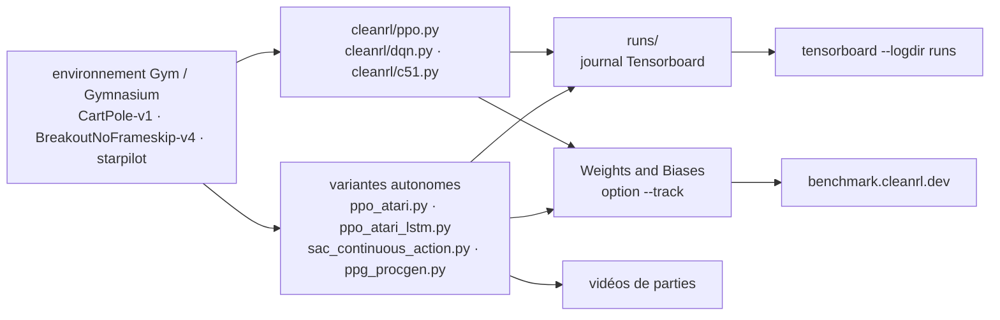

# vwxyzjn/cleanrl

> **Des algorithmes d'apprentissage par renforcement profond écrits un par fichier, à lire et à copier plutôt qu'à importer.**

## Le problème

Comprendre pourquoi une implémentation de PPO obtient tel score demande de connaître des
dizaines de détails qui, dans une bibliothèque modulaire, sont répartis entre classes de base,
wrappers et fichiers de configuration. On passe la journée à remonter des couches d'héritage
au lieu de lire l'algorithme, et prototyper une variante non prévue par le cadre oblige à
sous-classer trois niveaux plus haut.

## Ce que ça fait vraiment

CleanRL renverse le parti pris : *un fichier autonome par variante d'algorithme*. Le README
donne l'exemple de `ppo_atari.py`, 340 lignes, qui contient tous les détails
d'implémentation de PPO sur Atari — boucle d'entraînement, réseau, traitement des
observations, journalisation. Le prix assumé est la duplication : `ppo.py`, `ppo_atari.py`,
`ppo_atari_lstm.py`, `ppo_procgen.py` répètent le même socle.

Le catalogue couvre PPO, DQN, C51, SAC, DDPG, TD3, PPG, RND et Qdagger, souvent en plusieurs
variantes (PyTorch et JAX, Atari, contrôle continu, multi-GPU, multi-agent PettingZoo,
Isaac Gym, transformer-XL). Chaque script prend un `--env-id` et des hyperparamètres en
arguments de ligne de commande, et embarque quatre services annoncés dans le README :
journalisation Tensorboard, reproductibilité par graine (`--seed`), capture de vidéos de
parties, suivi d'expériences facultatif vers Weights and Biases (`--track`). Les résultats de
référence sont publiés (7+ algorithmes, 34+ jeux) et versés à Open RL Benchmark.

## Comment c'est branché



Aucun diagramme tiré du code n'existe pour ce dépôt : ce schéma est reconstruit depuis le seul
README. Le point à retenir est ce qui **n'y figure pas** — il n'y a pas de nœud central partagé
entre `ppo.py` et `dqn.py`. Chaque fichier va de l'environnement au journal tout seul ; ils ne
communiquent que par les conventions d'arguments et le répertoire `runs`.

## Essayer

```bash
git clone https://github.com/vwxyzjn/cleanrl.git && cd cleanrl
uv pip install .

# alternatively, you could use `uv venv` and do
# `python run cleanrl/ppo.py`
uv run python cleanrl/ppo.py \
    --seed 1 \
    --env-id CartPole-v0 \
    --total-timesteps 50000

# open another terminal and enter `cd cleanrl/cleanrl`
tensorboard --logdir runs
```

Sans `uv`, le README donne la voie `pip install -r requirements/requirements.txt`, plus un
fichier de dépendances par extra. Pour Atari et le suivi d'expériences :

```bash
uv pip install ".[atari]"
python cleanrl/dqn_atari.py --env-id BreakoutNoFrameskip-v4

wandb login # only required for the first time
uv run python cleanrl/ppo.py \
    --seed 1 \
    --env-id CartPole-v0 \
    --total-timesteps 50000 \
    --track \
    --wandb-project-name cleanrltest
```

## Coût et pièges

- **Fenêtre Python étroite** : le README exige `Python >=3.7.1,<3.11` et `uv 0.7.9+`. La borne
  haute est le vrai piège — un environnement récent est hors spécification.
- **Licence** : le README affiche un badge MIT, mais le catalogue relève `NOASSERTION`, c'est-à-dire
  que GitHub n'a pas su identifier le fichier de licence. L'intention est claire, la vérification
  ne l'est pas : à lever sur le `LICENSE` du dépôt avant tout usage interne. C'est la raison de
  l'alerte conservée.
- **Le coût réel est le calcul**, pas l'installation. CartPole tourne sur un portable ; Atari,
  Procgen, MuJoCo se comptent en heures de GPU. Le README mentionne un Pong appris en
  « ~5-10 mins » via envpool, et remercie le TPU Research Cloud de Google et le cluster de
  Hugging Face pour les ressources des campagnes de référence : l'ordre de grandeur de ces
  campagnes n'est pas à la portée d'une machine seule.
- **Weights and Biases est facultatif** : `--track` demande un compte, `wandb login` et une clé.
  Tensorboard en local suffit et reste le chemin par défaut.
- **Extras multiples** : `atari`, `envpool` (Linux uniquement), `procgen`, `mujoco`, `jax`,
  `pettingzoo`… chacun son fichier de dépendances, à installer séparément.
- **Migration Gym → Gymnasium en cours** au moment du README, suivie dans une pull request
  ouverte : selon la variante, l'API d'environnement attendue peut différer.

## Ce que ce n'est pas

- **Ce n'est pas une bibliothèque qu'on importe.** Le README l'écrit en toutes lettres : CleanRL
  n'est *pas* modulaire et n'est pas fait pour être importé. On ne fait pas
  `from cleanrl import PPO` ; on copie `ppo.py` dans son projet et on le modifie. La duplication
  entre fichiers est un choix, pas une dette à corriger.
- **Ce n'est donc pas une base de service** : pas d'API stable, pas de point d'entrée unique,
  pas de gestion de version des composants. Le code qu'on copie devient le sien, mises à jour
  amont comprises — c'est-à-dire non comprises.
- **Ce n'est pas un environnement ni un jeu de tâches** : les environnements viennent de Gym /
  Gymnasium, Atari, Procgen, MuJoCo, PettingZoo, installés à côté.
- **Ce n'est pas un raccourci vers un agent entraîné** : les scripts entraînent, ils ne livrent
  pas de politique prête à l'emploi (des modèles sont publiés sur Hugging Face, séparément).

## Alternatives

| | Quand le préférer |
|---|---|
| **DLR-RM/stable-baselines3** | Nommée dans le README au titre d'Open RL Benchmark, c'est la comparaison qui compte : bibliothèque modulaire, algorithmes instanciables et réutilisables depuis son code. À préférer dès qu'on veut *utiliser* un algorithme sans le lire. CleanRL à préférer quand on veut le lire et le modifier ligne à ligne. |
| **pytorch-labs/LeanRL** | Cité comme projet apparenté : reprend les algorithmes de CleanRL en version PyTorch optimisée avec CUDAGraphs. À préférer si le temps d'entraînement domine la lisibilité. |
| **corl-team/CORL** | Cité comme projet apparenté : même parti pris du fichier unique, mais pour l'apprentissage par renforcement *hors ligne*, absent de CleanRL. |

Les autres voisins du catalogue (`PennyLaneAI/pennylane`, `d2l-ai/d2l-en`,
`recommenders-team/recommenders`) ne sont pas comparables : rien à voir avec l'apprentissage
par renforcement profond.

## Pour toi

À adopter, mais pas comme dépendance : comme matière de lecture et point de départ. C'est la
référence la plus courte pour voir *tous* les détails d'une variante d'algorithme — exactement
ce qu'on cherche quand un entraînement ne converge pas et qu'on soupçonne un détail
d'implémentation. Avec les graines, Tensorboard et le suivi wandb déjà câblés dans chaque
fichier, c'est aussi un bon modèle de discipline expérimentale, transférable hors RL. À ne pas
choisir si l'objectif est de mettre un agent en service : prendre une bibliothèque modulaire.
