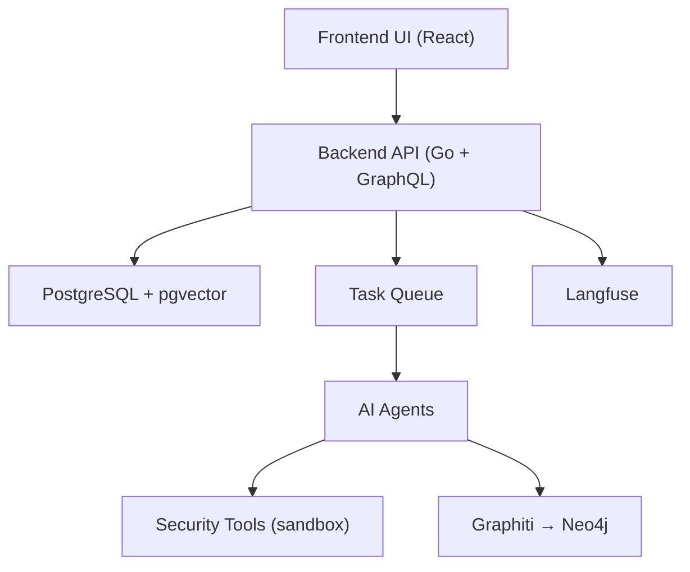

# vxcontrol/pentagi

> Plateforme de test d'intrusion autonome pilotée par agents LLM, pour professionnels de la sécurité.

## Le problème
Un test d'intrusion enchaîne des dizaines d'outils et de décisions ; l'enchaînement est manuel,
non rejouable, et les résultats d'une campagne ne servent pas à la suivante.

## Ce que ça fait vraiment
Un système multi-agents (Orchestrator, Researcher, Developer, Executor, Adviser, Reflector, Planner)
qui exécute des outils de sécurité dans des conteneurs Docker isolés, stocke ses observations dans
PostgreSQL + pgvector, et produit des rapports de vulnérabilités. Deux mécanismes bêta encadrent les
petits modèles : Execution Monitoring (`EXECUTION_MONITOR_ENABLED`) et Task Planning
(`AGENT_PLANNING_STEP_ENABLED`). Des plafonds durs d'appels d'outils sont toujours actifs.

## Comment c'est branché


## Essayer
```bash
mkdir -p pentagi && cd pentagi
wget -O installer.zip https://pentagi.com/downloads/linux/amd64/installer-latest.zip
unzip installer.zip
./installer
```

## Coût et pièges
Minimum 2 vCPU, 4 Go de RAM, 20 Go de disque, plus une clé chez l'un des 10+ fournisseurs LLM
supportés. Le monitoring et la planification multiplient par 2 à 3 la consommation de jetons et le
temps d'exécution, pour un gain de qualité annoncé ×2 sur Qwen3.5-27B-FP8. Aucune licence dans le README.

## Ce que ce n'est pas
Le README borne lui-même le périmètre : ce n'est pas un produit de simulation d'attaque à la CALDERA,
pas de campagnes prédéfinies ; les scripts d'attaque écrits par l'agent relèvent du futur, pas du présent.
L'export JSON du rapport de flow n'est pas documenté. Le README est tronqué avant la fin de l'installation.

## Alternatives
- CALDERA : nommé dans le README comme la catégorie BAS que PentAGI ne couvre pas.

## Pour toi
Hors de ton axe data/MLOps, sauf comme cas d'école d'une architecture multi-agents supervisée.
